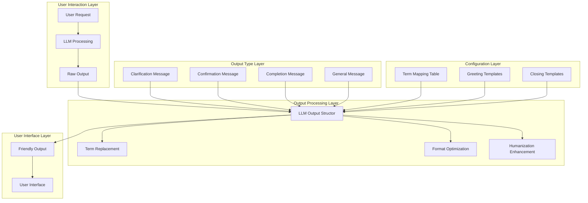
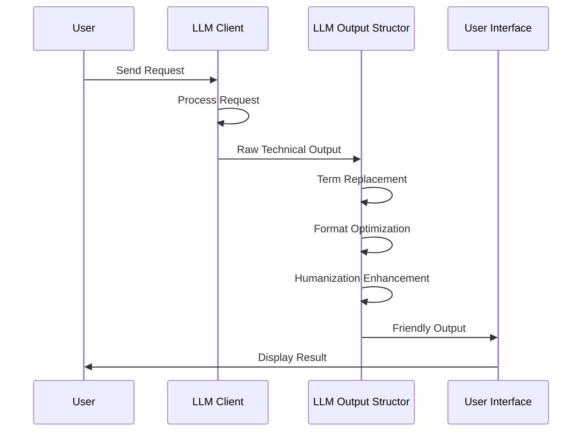
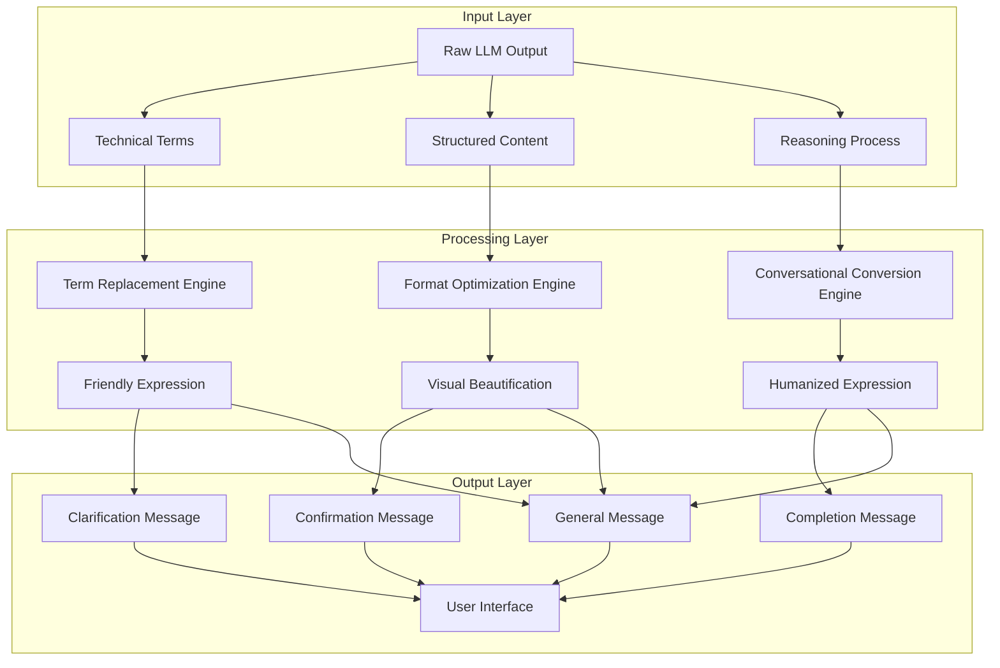
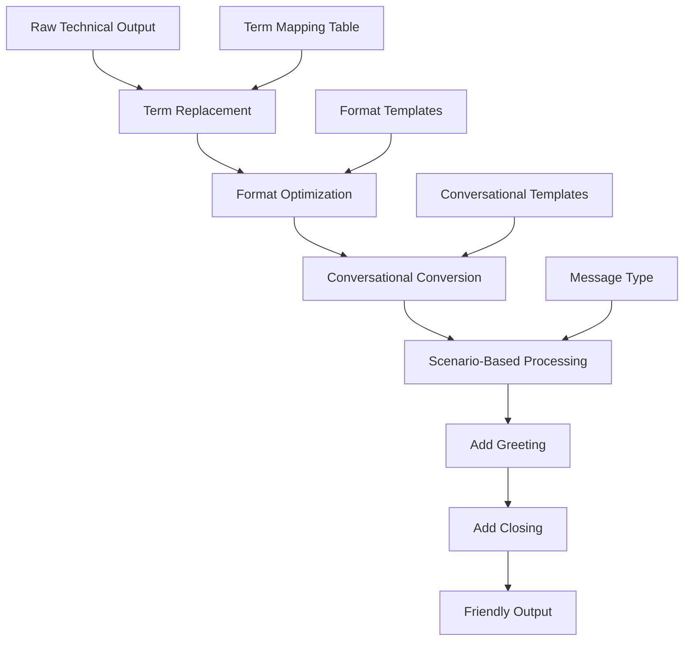
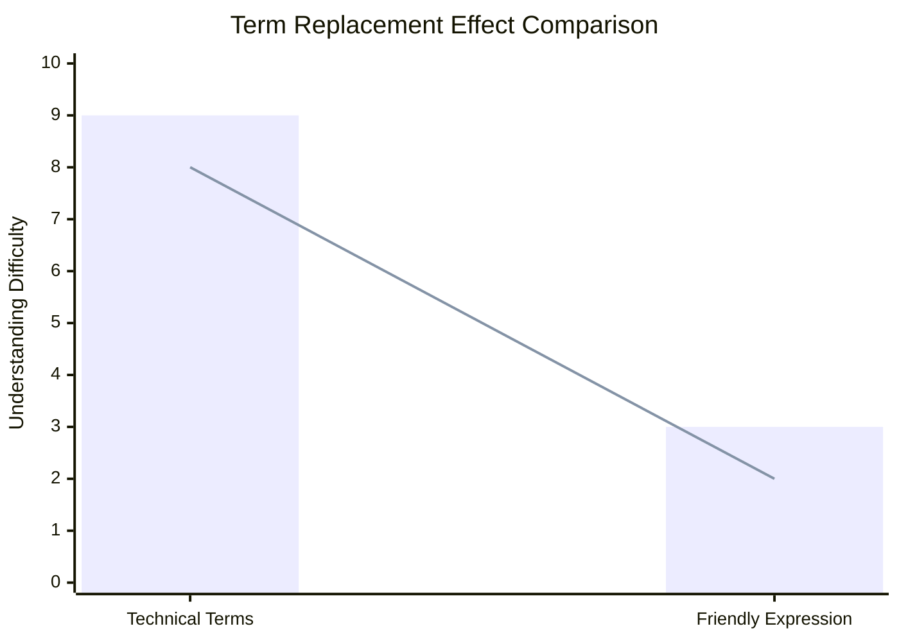
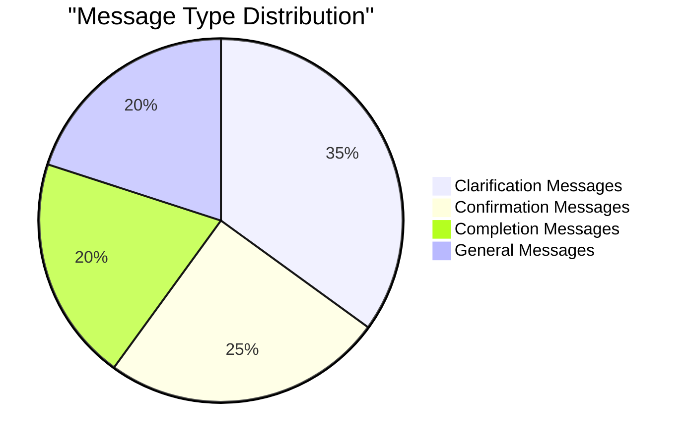

# LLM Output Structor Technical Documentation

## 1. Overview

**Purpose**: `LLM_output_structor.py` is the core component in the AIECS system responsible for LLM output formatting and readability enhancement. This module converts highly technical LLM outputs into more friendly, natural, and easy-to-understand formats while preserving the original analysis process and reasoning logic, significantly improving user experience and interaction quality.

**Core Value**:
- **Readability Enhancement**: Convert technical terms to user-friendly expressions, lowering understanding barriers
- **Structure Optimization**: Improve text format and layout, enhancing visual experience and reading efficiency
- **Humanized Interaction**: Add friendly greetings and closings, creating natural conversation atmosphere
- **Reasoning Preservation**: Maintain LLM's thinking process and analysis logic, ensuring transparency
- **Multi-Scenario Adaptation**: Support specialized optimization for different message types such as clarification, confirmation, completion

## 2. Problem Background & Design Motivation

### 2.1 Business Pain Points

During AIECS system development, we face the following key challenges:

1. **High Technical Barrier**: LLM outputs contain many technical terms and professional concepts, difficult for ordinary users to understand
2. **Poor Interaction Experience**: Original outputs lack humanized elements, feeling like machine dialogue rather than natural communication
3. **Chaotic Structure**: LLM output formats are inconsistent, lacking clear hierarchical structure and visual guidance
4. **Hidden Reasoning Process**: Important analysis processes and thinking logic are obscured by technical expressions
5. **Insufficient Scenario Adaptation**: Different business scenarios require different expression methods and interaction styles
6. **Low User Acceptance**: Rigid output formats affect user trust and willingness to use the system

### 2.2 Design Motivation

Based on the above pain points, we designed an intelligent output structuring component:

- **Lower Understanding Barrier**: Make technical content easier to understand through term replacement and language simplification
- **Improve Interaction Experience**: Add humanized elements, create natural and friendly conversation atmosphere
- **Optimize Visual Presentation**: Unify format standards, provide clear hierarchical structure and visual guidance
- **Maintain Transparency**: Preserve complete reasoning process while improving readability
- **Scenario-Based Optimization**: Provide specialized formatting and expression optimization for different business scenarios

## 3. Architecture Positioning & Context

### 3.1 System Architecture Diagram



### 3.2 Upstream and Downstream Dependencies

**Upstream Callers**:
- LLM Client: Provides original technical output
- Business Service Layer: Requires user-friendly output format
- Task Executor: Requires structured confirmation and clarification messages

**Downstream Dependencies**:
- User Interface: Displays formatted friendly output
- Message System: Sends enhanced interaction messages
- Logging System: Records conversion process and effects

**Peer Components**:
- Prompt Management: Provides original input content
- Output Validation: Ensures quality of converted content
- Multi-Language Support: Adapts to expression habits of different languages

### 3.3 Data Flow



## 4. Core Features & Use Cases

### 4.1 Intelligent Term Replacement

**Function Description**: Convert technical terms and professional concepts to user-friendly expressions, lowering understanding barriers.

**Core Features**:
- Comprehensive term mapping table covering common technical concepts
- Intelligent context matching, ensuring replacement accuracy
- Case-insensitive matching, improving replacement coverage
- Improve readability while maintaining original meaning

**Use Cases**:
```python
from aiecs.utils.LLM_output_structor import LLMOutputTransformer

# Create transformer instance
transformer = LLMOutputTransformer()

# Original technical output
technical_output = """
The demand_state is VAGUE_UNCLEAR and fails most SMART criteria.
The request lacks specificity and requires significant clarification.
I have generated a detailed smart_analysis with confidence level 0.8.
"""

# Convert to friendly expression
friendly_output = transformer._enhance_readability(technical_output)
print(friendly_output)
# Output:
# The request status is needs clarification and lacks several key details.
# The request lacks specificity and requires more details.
# I have generated a detailed analysis with certainty level 0.8.
```

**Real-world Application Cases**:
- **Requirement Analysis**: Convert technical requirement analysis to descriptions understandable by business personnel
- **Error Diagnosis**: Convert system error messages to user-friendly problem descriptions
- **Configuration Instructions**: Convert technical configuration parameters to operation guidance
- **Status Reports**: Convert system status information to intuitive status descriptions

### 4.2 Structured Format Optimization

**Function Description**: Improve text hierarchical structure, format layout, and visual presentation, enhancing reading experience.

**Core Features**:
- Unified title format, using emojis to enhance visual effects
- Optimized list format, providing clear hierarchical structure
- Intelligent paragraph segmentation, ensuring logical content grouping
- JSON structure beautification, improving data readability

**Use Cases**:
```python
# Original output
raw_content = """
Reasoning: The user request is not Specific and not Measurable.
Clarification needed: What is the exact scope? What are the success criteria?
Problem Analysis: This is a high-level goal that requires breaking down.
Solution Approach: We need to create a multi-stage plan.
"""

# Format processing
formatted_content = transformer._enhance_readability(raw_content)
print(formatted_content)
# Output:
# 💭 My Analysis: The user request is not specific enough and missing measurable goals.
# 
# 📝 Questions to Help Me Understand Better:
# • What is the exact scope?
# • What are the success criteria?
# 
# 🔍 Situation Overview: This is a general objective that requires breaking down.
# 
# 💡 Recommended Approach: We need to create a step-by-step plan.
```

**Real-world Application Cases**:
- **Report Generation**: Convert analysis reports to structured business documents
- **Operation Guides**: Convert technical operation steps to clear user manuals
- **Status Display**: Convert system status information to intuitive dashboard display
- **Error Instructions**: Convert error messages to structured troubleshooting guides

### 4.3 Humanized Interaction Enhancement

**Function Description**: Add friendly greetings, closings, and dialogue elements, creating natural interaction experience.

**Core Features**:
- Scenario-based greetings, selecting appropriate opening based on message type
- Personalized closings, providing corresponding follow-up action suggestions
- Conversational expression, converting third person to second person
- Emotional expression, using more natural and friendly language style

**Use Cases**:
```python
# Clarification message
clarification_content = """
The request needs more details about the timeline and budget.
Please provide specific requirements for the project scope.
"""

# Convert to friendly format
friendly_message = transformer.transform_message(
    content=clarification_content,
    message_type='clarification'
)
print(friendly_message)
# Output:
# Hello! Thank you for reaching out. Let me help you with your request.
# 
# The request needs more details about the timeline and budget.
# Please provide specific requirements for the project scope.
# 
# ✨ These details will help me provide you with the most accurate and helpful solution!
```

**Real-world Application Cases**:
- **Customer Service Dialogue**: Convert system responses to friendly customer service interactions
- **Guidance Instructions**: Convert operation guidance to thoughtful usage suggestions
- **Status Notifications**: Convert system notifications to warm status updates
- **Error Prompts**: Convert error messages to friendly problem-solving suggestions

### 4.4 Multi-Scenario Message Optimization

**Function Description**: Provide specialized formatting and expression optimization for different business scenarios.

**Core Features**:
- Clarification messages: Optimize question format, enhance guidance
- Confirmation messages: Strengthen plan display, improve credibility
- Completion messages: Highlight results display, enhance sense of achievement
- General messages: Maintain balance, ensure applicability

**Use Cases**:
```python
# Confirmation message optimization
confirmation_content = """
I have generated a detailed strategy:
- Phase 1: Requirements analysis
- Phase 2: System design
- Phase 3: Implementation
Do you want to proceed with this plan?
"""

# Convert to confirmation message format
confirmation_message = transformer.transform_message(
    content=confirmation_content,
    message_type='confirmation'
)
print(confirmation_message)
# Output:
# Great! I've carefully analyzed your requirements.
# 
# I've prepared a comprehensive strategy for you:
# 
# 📋 **Proposed Approach:**
# - Phase 1: Requirements analysis
# - Phase 2: System design
# - Phase 3: Implementation
# 
# 🤝 I'm ready to proceed whenever you are. Feel free to ask any questions or suggest modifications!
```

**Real-world Application Cases**:
- **Requirement Clarification**: Convert technical questions to guided clarification dialogue
- **Solution Confirmation**: Convert technical solutions to understandable business plans
- **Task Completion**: Convert technical results to user-friendly achievement display
- **Status Updates**: Convert system status to user-concerned progress information

## 5. API Reference

### 5.1 LLMOutputTransformer Class

#### Constructor
```python
def __init__(self)
```

**Function**: Initialize LLM output transformer
**Parameters**: None
**Returns**: `LLMOutputTransformer` instance

**Initialization Content**:
- Technical term replacement mapping table
- Friendly title mapping table
- Greeting templates
- Closing templates

#### Methods

##### transform_message
```python
def transform_message(self, content: str, message_type: str = 'general', preserve_structure: bool = True) -> str
```

**Function**: Transform LLM output to more readable format
**Parameters**:
- `content` (str, required): Original LLM output content
- `message_type` (str, optional): Message type, options:
  - `'clarification'`: Clarification message
  - `'confirmation'`: Confirmation message
  - `'completion'`: Completion message
  - `'general'`: General message
- `preserve_structure` (bool, optional): Whether to preserve original structure, default True

**Returns**:
- `str`: Transformed friendly output

**Exceptions**:
- No direct exceptions

**Usage Example**:
```python
transformer = LLMOutputTransformer()
result = transformer.transform_message(
    content="The request is VAGUE_UNCLEAR and needs clarification.",
    message_type='clarification'
)
```

##### _enhance_readability
```python
def _enhance_readability(self, content: str) -> str
```

**Function**: Enhance content readability
**Parameters**:
- `content` (str, required): Content to process

**Returns**:
- `str`: Enhanced content

**Processing Steps**:
1. Replace technical terms
2. Update title format
3. Format JSON structures
4. Optimize list format
5. Improve spacing layout

##### _enhance_clarification
```python
def _enhance_clarification(self, content: str) -> str
```

**Function**: Specifically optimize clarification messages
**Parameters**:
- `content` (str, required): Clarification message content

**Returns**:
- `str`: Optimized clarification message

**Special Processing**:
- Convert reasoning parts to conversational expression
- Format clarification questions
- Enhance guidance

##### _enhance_confirmation
```python
def _enhance_confirmation(self, content: str) -> str
```

**Function**: Specifically optimize confirmation messages
**Parameters**:
- `content` (str, required): Confirmation message content

**Returns**:
- `str`: Optimized confirmation message

**Special Processing**:
- Optimize technical descriptions
- Format plan display
- Enhance credibility expression

### 5.2 Convenience Functions

#### format_clarification_message
```python
def format_clarification_message(
    questions: List[str],
    round_number: int = 1,
    reasoning: Optional[str] = None
) -> str
```

**Function**: Format clarification message
**Parameters**:
- `questions` (List[str], required): List of clarification questions
- `round_number` (int, optional): Current round, default 1
- `reasoning` (Optional[str], optional): Reasoning process

**Returns**:
- `str`: Formatted clarification message

**Usage Example**:
```python
questions = [
    "What is the exact timeline for this project?",
    "What is the expected budget range?",
    "Who are the key stakeholders?"
]
message = format_clarification_message(questions, round_number=2)
```

#### format_confirmation_message
```python
def format_confirmation_message(
    content: Union[str, Dict[str, Any]],
    confirmation_type: str = 'strategy'
) -> str
```

**Function**: Format confirmation message
**Parameters**:
- `content` (Union[str, Dict[str, Any]], required): Confirmation content
- `confirmation_type` (str, optional): Confirmation type, default 'strategy'

**Returns**:
- `str`: Formatted confirmation message

**Usage Example**:
```python
strategy = {
    "phase1": "Requirements analysis",
    "phase2": "System design",
    "phase3": "Implementation"
}
message = format_confirmation_message(strategy, 'strategy')
```

#### enhance_reasoning
```python
def enhance_reasoning(reasoning: str) -> str
```

**Function**: Enhance reasoning text readability
**Parameters**:
- `reasoning` (str, required): Original reasoning text

**Returns**:
- `str`: Enhanced reasoning text

**Usage Example**:
```python
reasoning = "The user request is not specific enough and lacks measurable criteria."
enhanced = enhance_reasoning(reasoning)
# Output: "Looking at what you've shared, the user request is not specific enough and lacks measurable criteria."
```

#### clean_technical_terms
```python
def clean_technical_terms(content: str) -> str
```

**Function**: Clean technical terms
**Parameters**:
- `content` (str, required): Content containing technical terms

**Returns**:
- `str`: Cleaned content

**Usage Example**:
```python
technical_content = "The demand_state is VAGUE_UNCLEAR and fails SMART criteria."
cleaned = clean_technical_terms(technical_content)
# Output: "The request status is needs clarification and lacks several key details."
```

## 6. Technical Implementation Details

### 6.1 Term Replacement Mechanism

**Mapping Table Design**:
```python
self.technical_replacements = {
    # Mapping from technical terms to friendly expressions
    "demand_state": "request status",
    "VAGUE_UNCLEAR": "needs clarification",
    "SMART_COMPLIANT": "well-defined",
    # ... more mappings
}
```

**Replacement Algorithm**:
```python
def _enhance_readability(self, content: str) -> str:
    result = content
    
    # Replace headers
    for old_header, new_header in self.section_headers.items():
        result = result.replace(old_header, new_header)
    
    # Replace technical terms (case-insensitive)
    for technical, friendly in self.technical_replacements.items():
        result = re.sub(rf'\b{re.escape(technical)}\b', friendly, result, flags=re.IGNORECASE)
    
    return result
```

**Advantages**:
- Precise matching: Use word boundaries to ensure accurate replacement
- Case-insensitive: Improve replacement coverage
- Extensibility: Easy to add new term mappings

### 6.2 Conversational Conversion Mechanism

**Perspective Conversion**:
```python
def _convert_perspective(self, text: str) -> str:
    """Convert third person to second person"""
    # Replace "the user" with "your"
    text = re.sub(r"the user'?s?\s+", "your ", text, flags=re.IGNORECASE)
    text = re.sub(r"user'?s?\s+", "your ", text, flags=re.IGNORECASE)
    
    # Replace "the request" with "your request"
    text = re.sub(r"the request", "your request", text, flags=re.IGNORECASE)
    
    return text
```

**Conversational Expression**:
```python
def _make_reasoning_conversational(self, reasoning: str) -> str:
    """Convert reasoning to conversational expression"""
    sentences = reasoning.strip().split('.')
    conversational_parts = []
    
    for i, sentence in enumerate(sentences):
        sentence = sentence.strip()
        if not sentence:
            continue
            
        # Add guide phrase to first sentence
        if i == 0:
            sentence = "Looking at what you've shared, " + sentence.lower()
        # Add observation phrase to missing information sentences
        elif any(word in sentence.lower() for word in ["lacks", "missing"]):
            sentence = "I notice that it " + sentence.lower()
        # Add help phrase to requirement sentences
        elif any(word in sentence.lower() for word in ["requires", "needs"]):
            sentence = "To help you effectively, " + sentence.lower()
            
        conversational_parts.append(sentence)
    
    return '. '.join(conversational_parts)
```

### 6.3 Format Optimization Mechanism

**Title Beautification**:
```python
self.section_headers = {
    "Reasoning:": "💭 My Analysis:",
    "Clarification needed": "📝 Questions to Help Me Understand Better",
    "Problem Analysis:": "🔍 Situation Overview:",
    "Solution Approach:": "💡 Recommended Approach:",
    # ... more header mappings
}
```

**List Formatting**:
```python
def _enhance_bullet_points(self, content: str) -> str:
    """Optimize list format"""
    # Unify bullet symbols
    content = re.sub(r'^[-*•]\s*', '• ', content, flags=re.MULTILINE)
    # Bold numbering
    content = re.sub(r'^\d+\.\s*', lambda m: f"**{m.group(0)}**", content, flags=re.MULTILINE)
    return content
```

**JSON Structure Beautification**:
```python
def _format_json_structures(self, content: str) -> str:
    """Beautify JSON structures"""
    def format_dict(match):
        dict_str = match.group(0)
        formatted = dict_str.replace("'", "")
        formatted = formatted.replace("{", "{\n  ")
        formatted = formatted.replace(",", ",\n  ")
        formatted = formatted.replace("}", "\n}")
        return formatted
    
    return re.sub(r'\{[^{}]+\}', format_dict, content)
```

### 6.4 Scenario-Based Processing Mechanism

**Message Type Identification**:
```python
def transform_message(self, content: str, message_type: str = 'general', preserve_structure: bool = True) -> str:
    # Add greeting
    result = self._add_greeting(message_type)
    
    # Convert main content
    transformed_content = self._enhance_readability(content)
    
    # Scenario-based processing
    if message_type == 'clarification':
        transformed_content = self._enhance_clarification(transformed_content)
    elif message_type == 'confirmation':
        transformed_content = self._enhance_confirmation(transformed_content)
    
    # Add closing
    result += "\n\n" + transformed_content
    result += self._add_closing(message_type)
    
    return result
```

**Greeting and Closing Templates**:
```python
self.greetings = {
    'clarification': "Hello! Thank you for reaching out. Let me help you with your request.",
    'confirmation': "Great! I've carefully analyzed your requirements.",
    'completion': "Excellent! I've completed the analysis.",
    'general': "Thank you for your message."
}

self.closings = {
    'clarification': "\n\n✨ These details will help me provide you with the most accurate and helpful solution!",
    'confirmation': "\n\n🤝 I'm ready to proceed whenever you are. Feel free to ask any questions or suggest modifications!",
    'completion': "\n\n✅ Everything is set up and ready. Let me know if you need any adjustments!",
    'general': "\n\n💬 Please let me know if you need any clarification!"
}
```

### 6.5 Performance Optimization Strategies

**Regular Expression Optimization**:
- Pre-compile commonly used regular expressions
- Use non-greedy matching to reduce backtracking
- Reasonably use flags to improve matching efficiency

**String Operation Optimization**:
- Batch replacement to reduce multiple traversals
- Use string methods instead of regular expressions
- Avoid unnecessary string copying

**Memory Management**:
- Timely cleanup of temporary variables
- Use generators to process large text
- Avoid deep copying large objects

## 7. Configuration & Deployment

### 7.1 Environment Requirements

**Python Version**:
- Python 3.8+ (Python 3.9+ recommended)
- Support `typing` type annotations
- Support `re` regular expression module

**Dependencies**:
```python
# requirements.txt
# Core dependencies (no external dependencies)
# Only uses Python standard library
```

**Optional Dependencies**:
```python
# For advanced text processing (optional)
nltk>=3.7
spacy>=3.4.0
```

### 7.2 Configuration Options

**Basic Configuration**:
```python
# config.py
class LLMOutputStructorConfig:
    """LLM output structor configuration"""
    
    # Term replacement configuration
    ENABLE_TERM_REPLACEMENT = True
    CUSTOM_TERM_MAPPINGS = {}
    
    # Format optimization configuration
    ENABLE_EMOJI_HEADERS = True
    ENABLE_BULLET_FORMATTING = True
    ENABLE_JSON_FORMATTING = True
    
    # Conversational conversion configuration
    ENABLE_CONVERSATIONAL_CONVERSION = True
    ENABLE_PERSPECTIVE_CONVERSION = True
    
    # Scenario-based processing configuration
    ENABLE_SCENARIO_OPTIMIZATION = True
    CUSTOM_GREETINGS = {}
    CUSTOM_CLOSINGS = {}
```

**Environment Variable Configuration**:
```bash
# .env
LLM_OUTPUT_ENABLE_EMOJI=true
LLM_OUTPUT_ENABLE_CONVERSATIONAL=true
LLM_OUTPUT_CUSTOM_TERMS_FILE=/path/to/custom_terms.json
```

### 7.3 Deployment Configuration

**Docker Configuration**:
```dockerfile
FROM python:3.9-slim

WORKDIR /app

# Copy code
COPY aiecs/ ./aiecs/

# Set environment variables
ENV LLM_OUTPUT_ENABLE_EMOJI=true
ENV LLM_OUTPUT_ENABLE_CONVERSATIONAL=true

# Run application
CMD ["python", "-m", "aiecs.utils.LLM_output_structor"]
```

**Kubernetes Configuration**:
```yaml
apiVersion: apps/v1
kind: Deployment
metadata:
  name: aiecs-llm-output-structor
spec:
  replicas: 3
  selector:
    matchLabels:
      app: aiecs-llm-output-structor
  template:
    metadata:
      labels:
        app: aiecs-llm-output-structor
    spec:
      containers:
      - name: llm-output-structor
        image: aiecs/llm-output-structor:latest
        env:
        - name: LLM_OUTPUT_ENABLE_EMOJI
          value: "true"
        - name: LLM_OUTPUT_ENABLE_CONVERSATIONAL
          value: "true"
        resources:
          requests:
            memory: "64Mi"
            cpu: "50m"
          limits:
            memory: "128Mi"
            cpu: "100m"
```

### 7.4 Monitoring Configuration

**Performance Metrics**:
```python
from prometheus_client import Counter, Histogram, Gauge

# Define monitoring metrics
transformations_total = Counter('llm_output_transformations_total', 'Total transformations', ['message_type'])
transformation_duration_seconds = Histogram('llm_output_transformation_duration_seconds', 'Transformation duration')
term_replacements_total = Counter('llm_output_term_replacements_total', 'Total term replacements', ['term_type'])
```

**Health Check**:
```python
async def health_check():
    """LLM output structor health check"""
    try:
        # Test basic functionality
        transformer = LLMOutputTransformer()
        test_content = "The demand_state is VAGUE_UNCLEAR."
        result = transformer._enhance_readability(test_content)
        
        if "request status" not in result:
            return {"status": "unhealthy", "error": "Term replacement failed"}
        
        return {
            "status": "healthy",
            "timestamp": time.time(),
            "version": "1.0.0"
        }
    except Exception as e:
        return {"status": "unhealthy", "error": str(e)}
```

## 8. Maintenance & Troubleshooting

### 8.1 Monitoring Metrics

**Key Metrics**:
- Transformation success rate
- Transformation processing time
- Term replacement frequency
- Distribution of different message types

**Monitoring Dashboard**:
```python
# Grafana query examples
# Transformation success rate
rate(transformations_total[5m])

# Average transformation time
histogram_quantile(0.95, rate(transformation_duration_seconds_bucket[5m]))

# Term replacement distribution
rate(term_replacements_total[5m])
```

### 8.2 Common Issues & Solutions

#### 8.2.1 Inaccurate Term Replacement

**Symptoms**:
- Some technical terms not correctly replaced
- Replaced expressions inaccurate or not suitable for context
- User feedback indicates difficulty understanding

**Troubleshooting Steps**:
1. Check term mapping table: Confirm if terms are in mapping table
2. Analyze context: Check if replacement is suitable for current context
3. Review user feedback: Understand which terms need adjustment

**Solutions**:
```python
# Add custom term mappings
class CustomLLMOutputTransformer(LLMOutputTransformer):
    def __init__(self):
        super().__init__()
        # Add custom term mappings
        self.technical_replacements.update({
            "custom_term": "friendly_expression",
            "another_term": "another_expression"
        })
    
    def add_custom_mapping(self, technical: str, friendly: str):
        """Dynamically add term mapping"""
        self.technical_replacements[technical] = friendly
```

#### 8.2.2 Format Conversion Errors

**Symptoms**:
- Output format chaotic or not as expected
- Emojis or special characters display abnormally
- List format incorrect

**Troubleshooting Steps**:
1. Check input content: Confirm original content format
2. Analyze conversion logic: Review format conversion steps
3. Test edge cases: Verify special character handling

**Solutions**:
```python
# Enhance format conversion robustness
def _enhance_readability(self, content: str) -> str:
    try:
        result = content
        
        # Safely replace headers
        for old_header, new_header in self.section_headers.items():
            if old_header in result:
                result = result.replace(old_header, new_header)
        
        # Safely replace terms
        for technical, friendly in self.technical_replacements.items():
            try:
                result = re.sub(rf'\b{re.escape(technical)}\b', friendly, result, flags=re.IGNORECASE)
            except re.error as e:
                logger.warning(f"Regex error for term '{technical}': {e}")
                # Use simple replacement as fallback
                result = result.replace(technical, friendly)
        
        return result
    except Exception as e:
        logger.error(f"Error in readability enhancement: {e}")
        return content  # Return original content
```

#### 8.2.3 Performance Issues

**Symptoms**:
- Transformation processing time too long
- Memory usage continuously increases
- System response slows down

**Troubleshooting Steps**:
1. Analyze processing time: Use performance profiling tools
2. Check memory usage: Monitor memory growth trends
3. Optimize algorithms: Reduce unnecessary operations

**Solutions**:
```python
# Performance optimized version
class OptimizedLLMOutputTransformer(LLMOutputTransformer):
    def __init__(self):
        super().__init__()
        # Pre-compile regular expressions
        self._compiled_patterns = {}
        for technical in self.technical_replacements:
            try:
                self._compiled_patterns[technical] = re.compile(
                    rf'\b{re.escape(technical)}\b', 
                    flags=re.IGNORECASE
                )
            except re.error:
                self._compiled_patterns[technical] = None
    
    def _enhance_readability(self, content: str) -> str:
        result = content
        
        # Use pre-compiled regular expressions
        for technical, friendly in self.technical_replacements.items():
            pattern = self._compiled_patterns.get(technical)
            if pattern:
                result = pattern.sub(friendly, result)
            else:
                result = result.replace(technical, friendly)
        
        return result
```

### 8.3 Log Analysis

**Log Configuration**:
```python
import logging

# Configure LLM output structor logs
structor_logger = logging.getLogger('aiecs.llm_output_structor')
structor_logger.setLevel(logging.INFO)

# Add file handler
file_handler = logging.FileHandler('/var/log/aiecs/llm_output_structor.log')
file_handler.setFormatter(logging.Formatter(
    '%(asctime)s - %(name)s - %(levelname)s - %(message)s'
))
structor_logger.addHandler(file_handler)
```

**Key Log Patterns**:
```bash
# Find transformation errors
grep "ERROR" /var/log/aiecs/llm_output_structor.log | tail -100

# Analyze performance issues
grep "transformation_duration" /var/log/aiecs/llm_output_structor.log

# Monitor term replacements
grep "term_replacement" /var/log/aiecs/llm_output_structor.log | tail -50
```

### 8.4 Testing and Validation

**Unit Tests**:
```python
import unittest

class TestLLMOutputTransformer(unittest.TestCase):
    def setUp(self):
        self.transformer = LLMOutputTransformer()
    
    def test_term_replacement(self):
        """Test term replacement functionality"""
        input_text = "The demand_state is VAGUE_UNCLEAR."
        expected = "The request status is needs clarification."
        result = self.transformer._enhance_readability(input_text)
        self.assertIn("request status", result)
        self.assertIn("needs clarification", result)
    
    def test_message_transformation(self):
        """Test message transformation functionality"""
        content = "The request needs clarification."
        result = self.transformer.transform_message(content, 'clarification')
        self.assertIn("Hello!", result)
        self.assertIn("✨", result)
    
    def test_format_optimization(self):
        """Test format optimization functionality"""
        content = "Reasoning: This is a test.\nClarification needed: What is the scope?"
        result = self.transformer._enhance_readability(content)
        self.assertIn("💭 My Analysis:", result)
        self.assertIn("📝 Questions to Help Me Understand Better:", result)
```

**Integration Tests**:
```python
def test_end_to_end_transformation():
    """End-to-end transformation test"""
    transformer = LLMOutputTransformer()
    
    # Simulate real scenario
    technical_output = """
    Reasoning: The user request is not Specific and not Measurable.
    Clarification needed: What is the exact scope? What are the success criteria?
    Problem Analysis: This is a high-level goal that requires breaking down.
    """
    
    result = transformer.transform_message(technical_output, 'clarification')
    
    # Verify key elements
    assert "Hello!" in result
    assert "💭 My Analysis:" in result
    assert "📝 Questions to Help Me Understand Better:" in result
    assert "✨" in result
    assert "Looking at what you've shared" in result
```

## 9. Visualizations

### 9.1 System Architecture Diagram



### 9.2 Data Flow Diagram



### 9.3 Term Replacement Effect Chart



### 9.4 Message Type Distribution Chart



## 10. Version History

### v1.0.0 (2024-01-15)
**New Features**:
- Implement basic `LLMOutputTransformer` class
- Support technical term replacement
- Implement format optimization functionality
- Add basic conversational conversion

**Technical Features**:
- Regular expression-based term replacement
- Emoji title beautification
- Basic perspective conversion
- Simple format optimization

### v1.1.0 (2024-02-01)
**New Features**:
- Implement scenario-based message processing
- Add greeting and closing templates
- Support JSON structure beautification
- Enhance conversational conversion

**Improvements**:
- Optimize term replacement algorithm
- Enhance format conversion logic
- Improve perspective conversion accuracy
- Add more emojis

### v1.2.0 (2024-03-01)
**New Features**:
- Implement convenience function interfaces
- Add custom term mapping support
- Support batch processing
- Add performance monitoring

**Performance Optimizations**:
- Pre-compile regular expressions
- Optimize string operations
- Reduce memory usage
- Improve processing speed

### v1.3.0 (2024-04-01) [Planned]
**Planned Features**:
- Support multi-language term replacement
- Add intelligent context analysis
- Implement dynamic template generation
- Support user custom styles

**Performance Goals**:
- Processing time < 10ms
- Support 1000+ concurrent transformations
- 99.9% transformation success rate
- Memory usage < 50MB

---

## Appendix

### A. Related Documentation Links
- [Base LLM Client Documentation](../LLM/BASE_LLM_CLIENT.md)
- [WebSocket Manager Documentation](../INFRASTRUCTURE_MESSAGEING/WEBSOCKET_MANAGER.md)

### B. Example Code Repositories
- [Complete Example Project](https://github.com/aiecs/examples)
- [Term Mapping Configuration](https://github.com/aiecs/term-mappings)
- [Format Template Library](https://github.com/aiecs/format-templates)

### C. Technical Support
- Technical Documentation: https://docs.aiecs.com
- Issue Reporting: https://github.com/aiecs/issues
- Community Discussion: https://discord.gg/aiecs

### D. Best Practices

#### D.1 Term Mapping Best Practices
```python
# Create custom term mappings
class CustomTermMappings:
    """Custom term mapping best practices"""
    
    def __init__(self):
        self.mappings = {
            # Business-specific terms
            "API_ENDPOINT": "service interface",
            "DATABASE_QUERY": "data query",
            "AUTHENTICATION": "authentication",
            
            # Technical concept mappings
            "MICROSERVICE": "microservice",
            "CONTAINER": "container",
            "KUBERNETES": "K8s cluster",
            
            # Status descriptions
            "PENDING": "waiting",
            "PROCESSING": "processing",
            "COMPLETED": "completed",
            "FAILED": "failed"
        }
    
    def add_domain_specific_terms(self, domain: str, terms: Dict[str, str]):
        """Add domain-specific term mappings"""
        prefix = f"{domain.upper()}_"
        for technical, friendly in terms.items():
            self.mappings[f"{prefix}{technical}"] = friendly
```

#### D.2 Format Template Best Practices
```python
# Create custom format templates
class CustomFormatTemplates:
    """Custom format template best practices"""
    
    def __init__(self):
        self.templates = {
            'error_message': {
                'greeting': "Sorry, I encountered some issues.",
                'closing': "Please try again later, or contact technical support."
            },
            'success_message': {
                'greeting': "Great! The operation completed successfully.",
                'closing': "If you need anything else, please let me know."
            },
            'warning_message': {
                'greeting': "Please note, I found some things that need attention.",
                'closing': "I recommend checking carefully before continuing."
            }
        }
    
    def get_template(self, message_type: str) -> Dict[str, str]:
        """Get template for specified type"""
        return self.templates.get(message_type, self.templates['default'])
```

#### D.3 Performance Optimization Best Practices
```python
# Performance optimization configuration
class PerformanceOptimizedTransformer(LLMOutputTransformer):
    """Performance optimized transformer"""
    
    def __init__(self):
        super().__init__()
        self._cache = {}  # Result cache
        self._max_cache_size = 1000
    
    def transform_message(self, content: str, message_type: str = 'general', preserve_structure: bool = True) -> str:
        """Transformation method with cache"""
        # Generate cache key
        cache_key = f"{hash(content)}_{message_type}_{preserve_structure}"
        
        # Check cache
        if cache_key in self._cache:
            return self._cache[cache_key]
        
        # Execute transformation
        result = super().transform_message(content, message_type, preserve_structure)
        
        # Cache result
        if len(self._cache) < self._max_cache_size:
            self._cache[cache_key] = result
        
        return result
```
