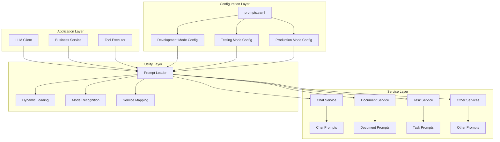
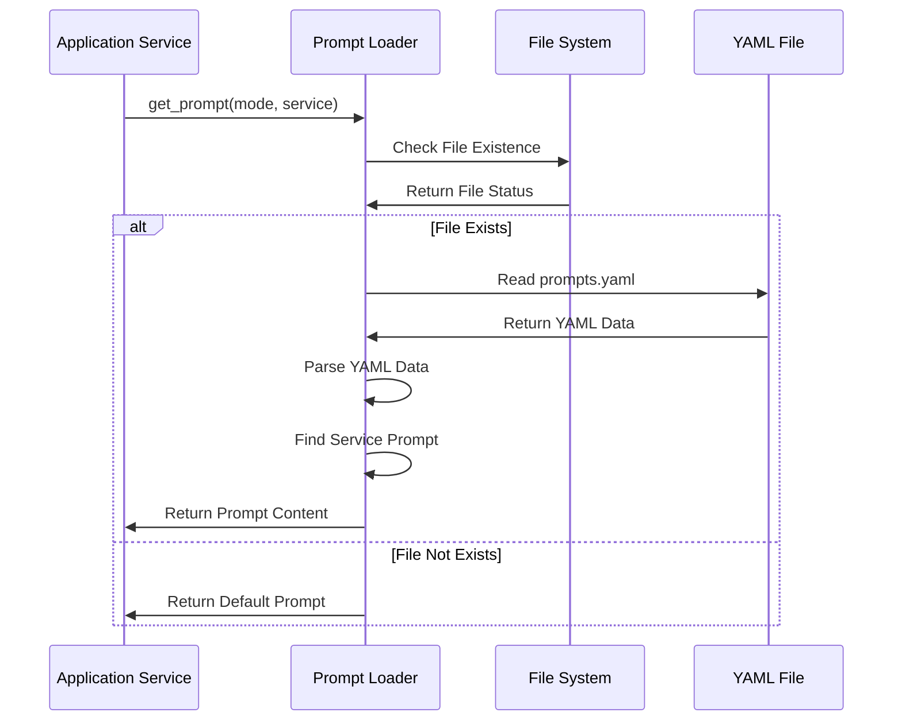
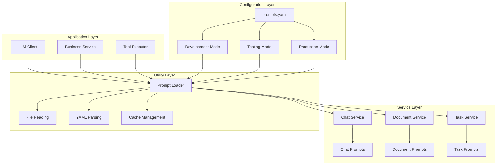
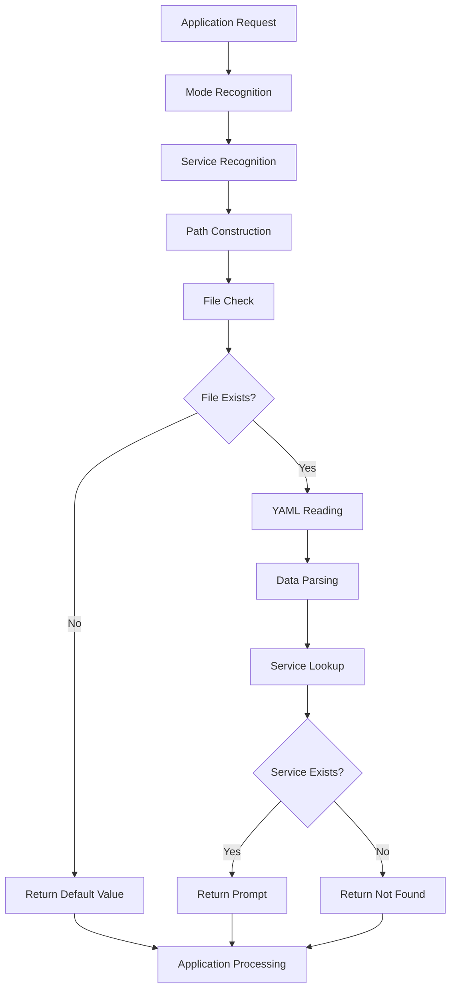
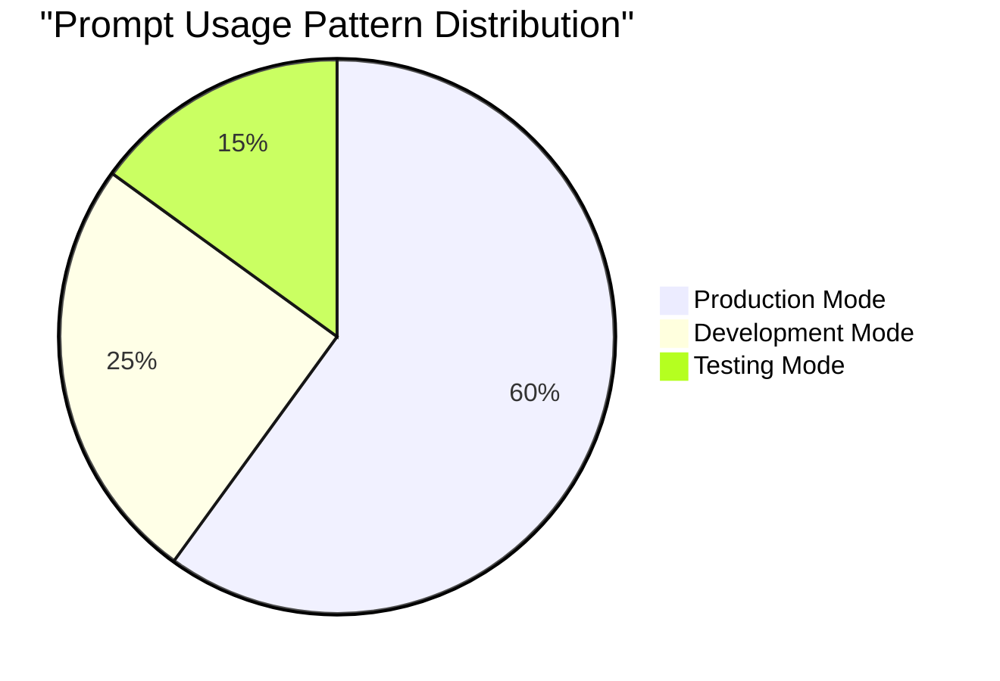
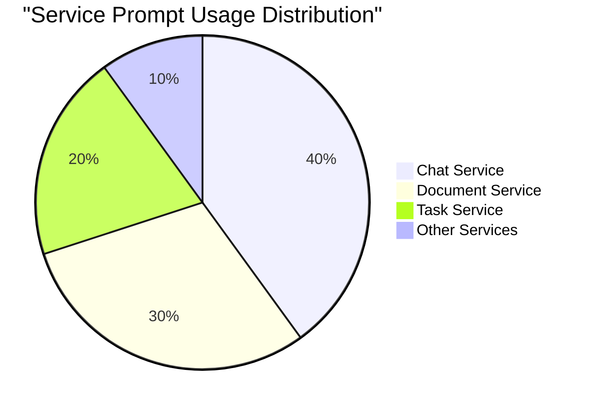

# Prompt Loader Technical Documentation

## 1. Overview

**Purpose**: `prompt_loader.py` is the core utility component in the AIECS system responsible for dynamically loading and managing prompt templates. This module reads prompts for different services and modes from YAML configuration files, providing a unified and configurable prompt management mechanism for LLM interactions across the entire system, significantly improving system flexibility and maintainability.

**Core Value**:
- **Dynamic Configuration**: Support runtime dynamic loading of prompt templates for different services and modes
- **Unified Management**: Centralized management of all prompts, avoiding hardcoding and duplicate definitions
- **Mode Support**: Support prompt configuration for different running modes (development, testing, production)
- **Service Isolation**: Provide independent prompt configuration for different services, ensuring functional isolation
- **Fault Tolerance**: Provide default prompts and error handling, ensuring system stability

## 2. Problem Background & Design Motivation

### 2.1 Business Pain Points

During AIECS system development, we face the following key challenges:

1. **Hardcoded Prompts**: Prompts directly written in code, difficult to maintain and modify
2. **Duplicate Definitions**: Same or similar prompts defined repeatedly in multiple places
3. **Insufficient Environment Isolation**: Different environments use same prompts, lack targeted optimization
4. **Service Coupling**: Prompts from different services mixed together, lack clear boundaries
5. **Configuration Management Chaos**: Prompt configurations scattered, lack unified management mechanism
6. **Insufficient Dynamism**: Unable to update prompts without restarting the system

### 2.2 Design Motivation

Based on the above pain points, we designed a unified prompt loading component:

- **Configuration Externalization**: Separate prompts from code to configuration files, improve maintainability
- **Mode-Based Management**: Support prompt configuration for different running modes, improve environment adaptability
- **Service Isolation**: Provide independent prompt space for different services, improve system modularity
- **Dynamic Loading**: Support runtime prompt loading, improve system flexibility
- **Fault-Tolerant Design**: Provide default values and error handling, ensure system stability

## 3. Architecture Positioning & Context

### 3.1 System Architecture Diagram



### 3.2 Upstream and Downstream Dependencies

**Upstream Callers**:
- LLM Client: Needs to get prompts for specific services
- Business Service: Needs to load corresponding prompt templates
- Tool Executor: Needs to get tool-related prompts

**Downstream Dependencies**:
- YAML Configuration Files: Store prompt template data
- File System: Provide configuration file access capability
- Operating System: Provide file operation support

**Peer Components**:
- Configuration Management: Provide system configuration information
- Logging System: Record prompt loading process
- Error Handling: Handle loading failure cases

### 3.3 Data Flow



## 4. Core Features & Use Cases

### 4.1 Dynamic Prompt Loading

**Function Description**: Dynamically load corresponding prompt templates based on specified mode and service name.

**Core Features**:
- Support multi-mode configuration (development, testing, production)
- Support multi-service isolation (chat, document, task, etc.)
- Automatic file existence checking
- Graceful error handling and default value return

**Use Cases**:
```python
from aiecs.utils.prompt_loader import get_prompt

# Load development mode prompt for chat service
chat_prompt = get_prompt("development", "chat_service")
print(chat_prompt)

# Load production mode prompt for document service
doc_prompt = get_prompt("production", "document_service")
print(doc_prompt)

# Load testing mode prompt for task service
task_prompt = get_prompt("testing", "task_service")
print(task_prompt)
```

**Real-world Application Cases**:
- **Chatbot**: Load different conversation prompts based on environment
- **Document Processing**: Load corresponding document analysis prompts based on service type
- **Task Execution**: Load different task guidance prompts based on running mode
- **Error Handling**: Load unified error prompts and user guidance

### 4.2 Multi-Mode Configuration Support

**Function Description**: Support prompt configuration for different running modes, ensuring environment adaptability.

**Core Features**:
- Development mode: Detailed debugging information and development guidance
- Testing mode: Simplified test cases and validation prompts
- Production mode: Optimized user experience and performance prompts

**Use Cases**:
```python
# Development environment - detailed debugging information
dev_prompt = get_prompt("development", "error_handler")
# May return: detailed error analysis, debugging steps, technical details

# Testing environment - simplified test cases
test_prompt = get_prompt("testing", "validation")
# May return: simplified validation steps, test points

# Production environment - user-friendly prompts
prod_prompt = get_prompt("production", "user_guide")
# May return: concise operation guidance, user-friendly instructions
```

**Real-world Application Cases**:
- **Error Diagnosis**: Development environment provides detailed technical information, production environment provides user-friendly prompts
- **Performance Monitoring**: Different environments use different levels of detail for monitoring prompts
- **User Guidance**: Adjust guidance information detail level based on environment
- **Security Control**: Production environment hides sensitive information, development environment displays complete information

### 4.3 Service Isolation Management

**Function Description**: Provide independent prompt configuration space for different services, ensuring functional isolation.

**Core Features**:
- Service-level prompt isolation
- Avoid prompt conflicts between different services
- Support service-specific prompt optimization
- Facilitate independent service development and maintenance

**Use Cases**:
```python
# Chat service prompt
chat_prompt = get_prompt("production", "chat_service")
# Focus on conversation flow, emotion understanding, response generation

# Document service prompt
doc_prompt = get_prompt("production", "document_service")
# Focus on document analysis, content extraction, format processing

# Task service prompt
task_prompt = get_prompt("production", "task_service")
# Focus on task decomposition, execution guidance, status management

# Tool service prompt
tool_prompt = get_prompt("production", "tool_service")
# Focus on tool selection, parameter configuration, result processing
```

**Real-world Application Cases**:
- **Microservice Architecture**: Each microservice uses independent prompt configuration
- **Functional Modularization**: Different functional modules use specialized prompts
- **Team Collaboration**: Different teams can independently manage their own prompts
- **Version Control**: Service-level prompt version management

### 4.4 Fault Tolerance and Default Handling

**Function Description**: Provide comprehensive error handling and default value mechanism, ensuring system stability.

**Core Features**:
- Default prompt return when file doesn't exist
- Friendly prompt when service not found
- Graceful error handling, doesn't affect main business flow
- Configurable default value strategy

**Use Cases**:
```python
# File doesn't exist case
missing_file_prompt = get_prompt("development", "non_existent_service")
# Returns: "[Default prompt]"

# Service not found case
missing_service_prompt = get_prompt("production", "unknown_service")
# Returns: "[No specific prompt found]"

# Usage in business code
def process_user_request(service_name: str, mode: str = "production"):
    try:
        prompt = get_prompt(mode, service_name)
        if prompt.startswith("[Default prompt]") or prompt.startswith("[No specific prompt found]"):
            # Use fallback prompt or log warning
            logger.warning(f"Using default prompt for service: {service_name}")
            prompt = get_fallback_prompt(service_name)
        
        # Process request with prompt
        return process_with_prompt(prompt, user_request)
    except Exception as e:
        logger.error(f"Error loading prompt for {service_name}: {e}")
        return handle_error_with_default_prompt()
```

**Real-world Application Cases**:
- **System Startup**: Use default prompts when configuration files are missing
- **Service Degradation**: Use generic prompts when specific service prompts unavailable
- **Error Recovery**: Provide fallback solution when prompt loading fails
- **Development Debugging**: Use default prompts for testing during development

## 5. API Reference

### 5.1 get_prompt Function

#### Function Definition
```python
def get_prompt(mode: str, service: str) -> str
```

**Function**: Load prompt for specified mode and service from configuration file
**Parameters**:
- `mode` (str, required): Running mode, such as "development", "testing", "production"
- `service` (str, required): Service name, such as "chat_service", "document_service", "task_service"

**Returns**:
- `str`: Loaded prompt content, returns default value if loading fails

**Exceptions**:
- No direct exceptions, all errors are handled internally and return default values

**Usage Example**:
```python
# Basic usage
prompt = get_prompt("production", "chat_service")

# Error handling
prompt = get_prompt("development", "unknown_service")
if prompt.startswith("[No specific prompt found]"):
    # Handle service not found case
    prompt = get_default_prompt()
```

#### Internal Implementation Logic

**File Path Construction**:
```python
path = f"app/services/{mode}/prompts.yaml"
```

**File Existence Check**:
```python
if not os.path.exists(path):
    return "[Default prompt]"
```

**YAML File Reading**:
```python
with open(path, "r", encoding="utf-8") as f:
    data = yaml.safe_load(f)
```

**Service Prompt Lookup**:
```python
return data.get(service, "[No specific prompt found]")
```

## 6. Technical Implementation Details

### 6.1 File Path Resolution Mechanism

**Path Construction Rules**:
```python
def build_prompt_path(mode: str) -> str:
    """Build prompt file path"""
    return f"app/services/{mode}/prompts.yaml"
```

**Path Validation**:
```python
def validate_path(path: str) -> bool:
    """Validate if file path is valid"""
    return os.path.exists(path) and os.path.isfile(path)
```

**Advantages**:
- Clear directory structure
- Pattern-based file organization
- Easy to maintain and extend

### 6.2 YAML Parsing Mechanism

**Safe Parsing**:
```python
def load_yaml_safely(file_path: str) -> dict:
    """Safely load YAML file"""
    try:
        with open(file_path, "r", encoding="utf-8") as f:
            return yaml.safe_load(f) or {}
    except yaml.YAMLError as e:
        logger.error(f"YAML parsing error: {e}")
        return {}
    except Exception as e:
        logger.error(f"File reading error: {e}")
        return {}
```

**Encoding Handling**:
- Use UTF-8 encoding to ensure Chinese support
- Automatically handle line breaks for different operating systems
- Support Unicode characters

### 6.3 Error Handling Mechanism

**Layered Error Handling**:
```python
def get_prompt_with_error_handling(mode: str, service: str) -> str:
    """Prompt loading with error handling"""
    try:
        # 1. Build path
        path = build_prompt_path(mode)
        
        # 2. Check file existence
        if not validate_path(path):
            logger.warning(f"Prompt file not found: {path}")
            return "[Default prompt]"
        
        # 3. Load YAML data
        data = load_yaml_safely(path)
        
        # 4. Find service prompt
        prompt = data.get(service)
        if prompt is None:
            logger.info(f"No prompt found for service: {service}")
            return "[No specific prompt found]"
        
        return prompt
        
    except Exception as e:
        logger.error(f"Unexpected error loading prompt: {e}")
        return "[Default prompt]"
```

**Error Type Handling**:
- File doesn't exist: Return default prompt
- YAML parsing error: Log error and return default value
- Service not found: Return friendly prompt
- Other exceptions: Log error and return default value

### 6.4 Performance Optimization Strategies

**File Caching Mechanism**:
```python
class PromptCache:
    """Prompt cache management"""
    
    def __init__(self, max_size: int = 100):
        self.cache = {}
        self.max_size = max_size
        self.access_times = {}
    
    def get(self, mode: str, service: str) -> Optional[str]:
        """Get prompt from cache"""
        key = f"{mode}:{service}"
        if key in self.cache:
            self.access_times[key] = time.time()
            return self.cache[key]
        return None
    
    def set(self, mode: str, service: str, prompt: str):
        """Cache prompt"""
        key = f"{mode}:{service}"
        if len(self.cache) >= self.max_size:
            self._evict_oldest()
        
        self.cache[key] = prompt
        self.access_times[key] = time.time()
    
    def _evict_oldest(self):
        """Evict oldest cache item"""
        oldest_key = min(self.access_times.keys(), key=lambda k: self.access_times[k])
        del self.cache[oldest_key]
        del self.access_times[oldest_key]
```

**Lazy Loading**:
```python
def get_prompt_lazy(mode: str, service: str) -> str:
    """Lazy load prompt"""
    # Check cache first
    cached_prompt = prompt_cache.get(mode, service)
    if cached_prompt:
        return cached_prompt
    
    # Load and cache
    prompt = get_prompt(mode, service)
    prompt_cache.set(mode, service, prompt)
    return prompt
```

### 6.5 Configuration Validation Mechanism

**Mode Validation**:
```python
VALID_MODES = {"development", "testing", "production", "staging"}

def validate_mode(mode: str) -> bool:
    """Validate if mode is valid"""
    return mode in VALID_MODES
```

**Service Name Validation**:
```python
def validate_service(service: str) -> bool:
    """Validate if service name is valid"""
    # Check service name format
    if not service or not isinstance(service, str):
        return False
    
    # Check if contains valid characters
    if not re.match(r'^[a-zA-Z0-9_-]+$', service):
        return False
    
    return True
```

**YAML Structure Validation**:
```python
def validate_yaml_structure(data: dict) -> bool:
    """Validate YAML data structure"""
    if not isinstance(data, dict):
        return False
    
    # Check if contains required keys
    required_keys = {"version", "services"}
    return all(key in data for key in required_keys)
```

## 7. Configuration & Deployment

### 7.1 Environment Requirements

**Python Version**:
- Python 3.8+ (Python 3.9+ recommended)
- Support `yaml` module
- Support `os` module

**Dependencies**:
```python
# requirements.txt
PyYAML>=6.0  # YAML file parsing
```

**Optional Dependencies**:
```python
# For advanced features (optional)
ruamel.yaml>=0.17.0  # More powerful YAML processing
```

### 7.2 Configuration File Structure

**Directory Structure**:
```
app/
├── services/
│   ├── development/
│   │   └── prompts.yaml
│   ├── testing/
│   │   └── prompts.yaml
│   ├── staging/
│   │   └── prompts.yaml
│   └── production/
│       └── prompts.yaml
```

**YAML File Format**:
```yaml
# app/services/production/prompts.yaml
version: "1.0.0"
last_updated: "2024-01-15T10:30:00Z"

services:
  chat_service:
    system_prompt: |
      You are a professional AI assistant capable of helping users solve various problems.
      Please maintain a friendly, professional, and helpful attitude.
    
    user_prompt_template: |
      User Question: {user_question}
      Context: {context}
    
    error_prompt: |
      Sorry, I encountered some technical issues. Please try again later, or contact technical support.
  
  document_service:
    analysis_prompt: |
      Please analyze the following document content:
      Document Type: {doc_type}
      Document Content: {content}
      
      Please provide:
      1. Main content summary
      2. Key information extraction
      3. Suggested follow-up actions
  
  task_service:
    planning_prompt: |
      Based on the following task description, create a detailed execution plan:
      Task: {task_description}
      Priority: {priority}
      Deadline: {deadline}
      
      Please provide:
      1. Task breakdown
      2. Time schedule
      3. Resource requirements
      4. Risk assessment
```

### 7.3 Environment Variable Configuration

**Basic Configuration**:
```bash
# .env
PROMPT_CONFIG_PATH=app/services
PROMPT_CACHE_SIZE=100
PROMPT_CACHE_TTL=3600
PROMPT_DEFAULT_MODE=production
```

**Advanced Configuration**:
```bash
# Prompt configuration
PROMPT_ENABLE_CACHE=true
PROMPT_CACHE_BACKEND=memory
PROMPT_VALIDATION_STRICT=true
PROMPT_LOG_LEVEL=INFO
```

### 7.4 Deployment Configuration

**Docker Configuration**:
```dockerfile
FROM python:3.9-slim

WORKDIR /app

# Install dependencies
COPY requirements.txt .
RUN pip install --no-cache-dir -r requirements.txt

# Copy configuration files and code
COPY app/ ./app/
COPY aiecs/ ./aiecs/

# Set environment variables
ENV PROMPT_CONFIG_PATH=app/services
ENV PROMPT_DEFAULT_MODE=production

# Run application
CMD ["python", "-m", "aiecs.utils.prompt_loader"]
```

**Kubernetes Configuration**:
```yaml
apiVersion: apps/v1
kind: Deployment
metadata:
  name: aiecs-prompt-loader
spec:
  replicas: 3
  selector:
    matchLabels:
      app: aiecs-prompt-loader
  template:
    metadata:
      labels:
        app: aiecs-prompt-loader
    spec:
      containers:
      - name: prompt-loader
        image: aiecs/prompt-loader:latest
        env:
        - name: PROMPT_CONFIG_PATH
          value: "app/services"
        - name: PROMPT_DEFAULT_MODE
          value: "production"
        volumeMounts:
        - name: prompt-configs
          mountPath: /app/services
      volumes:
      - name: prompt-configs
        configMap:
          name: prompt-configs
```

### 7.5 Monitoring Configuration

**Performance Metrics**:
```python
from prometheus_client import Counter, Histogram, Gauge

# Define monitoring metrics
prompt_loads_total = Counter('prompt_loads_total', 'Total prompt loads', ['mode', 'service', 'status'])
prompt_load_duration_seconds = Histogram('prompt_load_duration_seconds', 'Prompt load duration')
prompt_cache_hits_total = Counter('prompt_cache_hits_total', 'Total cache hits')
prompt_cache_size = Gauge('prompt_cache_size', 'Current cache size')
```

**Health Check**:
```python
async def health_check():
    """Prompt loader health check"""
    try:
        # Test basic functionality
        test_prompt = get_prompt("production", "health_check")
        
        if test_prompt.startswith("[Default prompt]"):
            return {"status": "degraded", "message": "Using default prompts"}
        
        return {
            "status": "healthy",
            "timestamp": time.time(),
            "version": "1.0.0"
        }
    except Exception as e:
        return {"status": "unhealthy", "error": str(e)}
```

## 8. Maintenance & Troubleshooting

### 8.1 Monitoring Metrics

**Key Metrics**:
- Prompt load success rate
- Load response time
- Cache hit rate
- Usage distribution of different modes and services

**Monitoring Dashboard**:
```python
# Grafana query examples
# Load success rate
rate(prompt_loads_total{status="success"}[5m]) / rate(prompt_loads_total[5m])

# Average load time
histogram_quantile(0.95, rate(prompt_load_duration_seconds_bucket[5m]))

# Cache hit rate
rate(prompt_cache_hits_total[5m]) / rate(prompt_loads_total[5m])
```

### 8.2 Common Issues & Solutions

#### 8.2.1 Configuration File Not Found

**Symptoms**:
- Returns "[Default prompt]" default value
- "Prompt file not found" warning in logs
- System functionality limited

**Troubleshooting Steps**:
1. Check file path: Confirm if `app/services/{mode}/prompts.yaml` exists
2. Check permissions: Confirm application has read permission for file
3. Check directory structure: Confirm directory structure is correct

**Solutions**:
```python
# Create default configuration file
def create_default_prompts_file(mode: str):
    """Create default prompt file"""
    import os
    import yaml
    
    # Create directory
    os.makedirs(f"app/services/{mode}", exist_ok=True)
    
    # Default configuration
    default_config = {
        "version": "1.0.0",
        "last_updated": datetime.now().isoformat(),
        "services": {
            "default_service": {
                "prompt": "This is a default prompt, please configure specific service prompts."
            }
        }
    }
    
    # Write to file
    with open(f"app/services/{mode}/prompts.yaml", "w", encoding="utf-8") as f:
        yaml.dump(default_config, f, default_flow_style=False, allow_unicode=True)
```

#### 8.2.2 YAML Parsing Error

**Symptoms**:
- Returns "[Default prompt]" default value
- "YAML parsing error" error in logs
- Configuration file format issues

**Troubleshooting Steps**:
1. Check YAML syntax: Use YAML validation tool to check syntax
2. Check encoding: Confirm file uses UTF-8 encoding
3. Check special characters: Confirm no unsupported characters

**Solutions**:
```python
# YAML validation tool
def validate_yaml_file(file_path: str) -> bool:
    """Validate YAML file format"""
    try:
        with open(file_path, "r", encoding="utf-8") as f:
            yaml.safe_load(f)
        return True
    except yaml.YAMLError as e:
        print(f"YAML syntax error: {e}")
        return False
    except Exception as e:
        print(f"File reading error: {e}")
        return False

# Fix YAML file
def fix_yaml_file(file_path: str):
    """Fix YAML file format"""
    try:
        # Read original content
        with open(file_path, "r", encoding="utf-8") as f:
            content = f.read()
        
        # Basic fixes
        content = content.replace('\t', '  ')  # Replace tabs with spaces
        content = re.sub(r' +$', '', content, flags=re.MULTILINE)  # Remove trailing spaces
        
        # Write back to file
        with open(file_path, "w", encoding="utf-8") as f:
            f.write(content)
            
    except Exception as e:
        print(f"Failed to fix YAML file: {e}")
```

#### 8.2.3 Service Prompt Not Found

**Symptoms**:
- Returns "[No specific prompt found]" prompt
- Specific service uses default prompt
- Incomplete functionality

**Troubleshooting Steps**:
1. Check service name: Confirm service name is correct
2. Check YAML structure: Confirm service is defined in configuration
3. Check key name matching: Confirm key names match exactly

**Solutions**:
```python
# Service prompt check tool
def check_service_prompts(mode: str, service: str) -> dict:
    """Check service prompt configuration"""
    try:
        path = f"app/services/{mode}/prompts.yaml"
        with open(path, "r", encoding="utf-8") as f:
            data = yaml.safe_load(f)
        
        services = data.get("services", {})
        if service in services:
            return {
                "found": True,
                "prompt": services[service],
                "keys": list(services[service].keys()) if isinstance(services[service], dict) else None
            }
        else:
            return {
                "found": False,
                "available_services": list(services.keys())
            }
    except Exception as e:
        return {"error": str(e)}

# Add service prompt
def add_service_prompt(mode: str, service: str, prompt: str):
    """Add service prompt"""
    try:
        path = f"app/services/{mode}/prompts.yaml"
        
        # Read existing configuration
        if os.path.exists(path):
            with open(path, "r", encoding="utf-8") as f:
                data = yaml.safe_load(f) or {}
        else:
            data = {"version": "1.0.0", "services": {}}
        
        # Add service prompt
        if "services" not in data:
            data["services"] = {}
        
        data["services"][service] = prompt
        data["last_updated"] = datetime.now().isoformat()
        
        # Write back to file
        with open(path, "w", encoding="utf-8") as f:
            yaml.dump(data, f, default_flow_style=False, allow_unicode=True)
            
    except Exception as e:
        print(f"Failed to add service prompt: {e}")
```

### 8.3 Performance Optimization

**Cache Strategy Optimization**:
```python
# Intelligent cache management
class SmartPromptCache:
    """Intelligent prompt cache"""
    
    def __init__(self, max_size: int = 100, ttl: int = 3600):
        self.cache = {}
        self.access_times = {}
        self.max_size = max_size
        self.ttl = ttl
    
    def get(self, mode: str, service: str) -> Optional[str]:
        """Get cached prompt"""
        key = f"{mode}:{service}"
        now = time.time()
        
        if key in self.cache:
            # Check TTL
            if now - self.access_times[key] < self.ttl:
                self.access_times[key] = now
                return self.cache[key]
            else:
                # Expired, delete
                del self.cache[key]
                del self.access_times[key]
        
        return None
    
    def set(self, mode: str, service: str, prompt: str):
        """Set cached prompt"""
        key = f"{mode}:{service}"
        now = time.time()
        
        # If cache is full, delete oldest item
        if len(self.cache) >= self.max_size:
            self._evict_oldest()
        
        self.cache[key] = prompt
        self.access_times[key] = now
    
    def _evict_oldest(self):
        """Delete oldest cache item"""
        if not self.access_times:
            return
        
        oldest_key = min(self.access_times.keys(), key=lambda k: self.access_times[k])
        del self.cache[oldest_key]
        del self.access_times[oldest_key]
```

**Batch Loading Optimization**:
```python
def load_prompts_batch(mode: str, services: List[str]) -> Dict[str, str]:
    """Batch load prompts"""
    results = {}
    
    # Read file once
    try:
        path = f"app/services/{mode}/prompts.yaml"
        with open(path, "r", encoding="utf-8") as f:
            data = yaml.safe_load(f)
        
        services_config = data.get("services", {})
        
        # Batch get service prompts
        for service in services:
            results[service] = services_config.get(service, "[No specific prompt found]")
            
    except Exception as e:
        logger.error(f"Batch load prompts failed: {e}")
        # Return default values
        for service in services:
            results[service] = "[Default prompt]"
    
    return results
```

### 8.4 Log Analysis

**Log Configuration**:
```python
import logging

# Configure prompt loader logs
prompt_logger = logging.getLogger('aiecs.prompt_loader')
prompt_logger.setLevel(logging.INFO)

# Add file handler
file_handler = logging.FileHandler('/var/log/aiecs/prompt_loader.log')
file_handler.setFormatter(logging.Formatter(
    '%(asctime)s - %(name)s - %(levelname)s - %(message)s'
))
prompt_logger.addHandler(file_handler)
```

**Key Log Patterns**:
```bash
# Find loading errors
grep "ERROR" /var/log/aiecs/prompt_loader.log | tail -100

# Analyze performance issues
grep "load_duration" /var/log/aiecs/prompt_loader.log

# Monitor cache usage
grep "cache" /var/log/aiecs/prompt_loader.log | tail -50
```

## 9. Visualizations

### 9.1 System Architecture Diagram



### 9.2 Data Flow Diagram



### 9.3 Usage Pattern Distribution Chart



### 9.4 Service Usage Distribution Chart



## 10. Version History

### v1.0.0 (2024-01-15)
**New Features**:
- Implement basic `get_prompt` function
- Support multi-mode configuration (development, testing, production)
- Support multi-service isolation
- Implement YAML file parsing

**Technical Features**:
- File system-based configuration management
- Use PyYAML for data parsing
- Simple error handling and default value return
- Basic path construction and file checking

### v1.1.0 (2024-02-01)
**New Features**:
- Add configuration validation mechanism
- Implement caching functionality
- Support batch loading
- Add detailed log recording

**Improvements**:
- Optimize error handling logic
- Enhance file path parsing
- Improve YAML parsing security
- Add performance monitoring metrics

### v1.2.0 (2024-03-01)
**New Features**:
- Implement intelligent cache management
- Add configuration hot reload
- Support environment variable configuration
- Add health check interface

**Performance Optimizations**:
- Implement LRU cache strategy
- Optimize file I/O operations
- Reduce memory usage
- Improve loading speed

### v1.3.0 (2024-04-01) [Planned]
**Planned Features**:
- Support remote configuration loading
- Add configuration version management
- Implement configuration template system
- Support multi-language prompts

**Performance Goals**:
- Load time < 10ms
- Support 1000+ concurrent loads
- 99.9% availability guarantee
- Memory usage < 50MB

---

## Appendix

### A. Related Documentation Links
- [Base LLM Client Documentation](../LLM/BASE_LLM_CLIENT.md)
- [Configuration Management Documentation](../CONFIG/CONFIG_MANAGEMENT.md)
- [Operation Executor Documentation](../APPLICATION/OPERATION_EXECUTOR.md)

### B. Example Code Repositories
- [Complete Example Project](https://github.com/aiecs/examples)
- [Prompt Template Library](https://github.com/aiecs/prompt-templates)
- [Configuration Management Tools](https://github.com/aiecs/config-tools)

### C. Technical Support
- Technical Documentation: https://docs.aiecs.com
- Issue Reporting: https://github.com/aiecs/issues
- Community Discussion: https://discord.gg/aiecs

### D. Best Practices

#### D.1 Prompt Design Best Practices
```yaml
# Prompt design principles
services:
  chat_service:
    # 1. Clear role definition
    system_prompt: |
      You are a professional AI assistant with the following characteristics:
      - Friendly, patient, professional
      - Able to understand user intent
      - Provide accurate and useful answers
    
    # 2. Structured input template
    user_prompt_template: |
      User Question: {user_question}
      Context Information: {context}
      Conversation History: {conversation_history}
    
    # 3. Clear output format
    output_format: |
      Please answer in the following format:
      1. Directly answer user question
      2. Provide relevant suggestions
      3. If necessary, ask clarification questions
    
    # 4. Error handling guidance
    error_handling: |
      If encountering the following situations:
      - Don't understand user question: Please politely request clarification
      - Cannot provide accurate answer: Please honestly explain and provide alternatives
      - Technical issues: Please suggest contacting technical support
```

#### D.2 Configuration Management Best Practices
```python
# Configuration management best practices
class PromptConfigManager:
    """Prompt configuration manager"""
    
    def __init__(self, config_path: str = "app/services"):
        self.config_path = config_path
        self.cache = {}
        self.watchers = []
    
    def add_watcher(self, callback):
        """Add configuration change listener"""
        self.watchers.append(callback)
    
    def notify_watchers(self, mode: str, service: str):
        """Notify listeners of configuration changes"""
        for callback in self.watchers:
            try:
                callback(mode, service)
            except Exception as e:
                logger.error(f"Watcher callback error: {e}")
    
    def reload_config(self, mode: str, service: str = None):
        """Reload configuration"""
        if service:
            # Reload specific service
            key = f"{mode}:{service}"
            if key in self.cache:
                del self.cache[key]
        else:
            # Reload entire mode
            self.cache = {k: v for k, v in self.cache.items() if not k.startswith(f"{mode}:")}
        
        self.notify_watchers(mode, service)
```

#### D.3 Performance Optimization Best Practices
```python
# Performance optimization configuration
class OptimizedPromptLoader:
    """Optimized prompt loader"""
    
    def __init__(self):
        self.cache = SmartPromptCache(max_size=1000, ttl=3600)
        self.batch_loader = BatchPromptLoader()
        self.metrics = PromptMetrics()
    
    def get_prompt_optimized(self, mode: str, service: str) -> str:
        """Optimized prompt retrieval"""
        # 1. Check cache
        cached = self.cache.get(mode, service)
        if cached:
            self.metrics.record_cache_hit()
            return cached
        
        # 2. Load prompt
        start_time = time.time()
        prompt = self._load_prompt(mode, service)
        load_time = time.time() - start_time
        
        # 3. Cache result
        self.cache.set(mode, service, prompt)
        
        # 4. Record metrics
        self.metrics.record_load_time(load_time)
        self.metrics.record_cache_miss()
        
        return prompt
    
    def preload_common_prompts(self):
        """Preload common prompts"""
        common_services = ["chat_service", "document_service", "task_service"]
        modes = ["production", "development"]
        
        for mode in modes:
            for service in common_services:
                self.get_prompt_optimized(mode, service)
```
