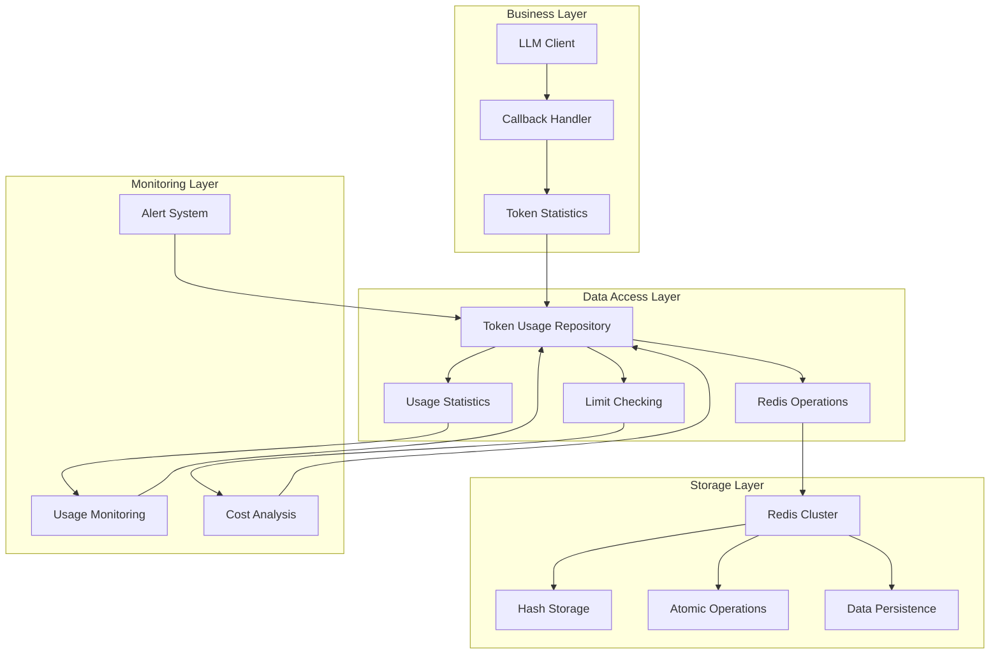
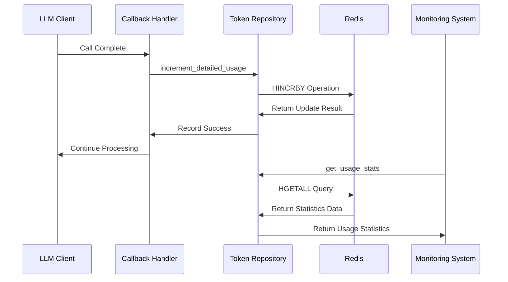
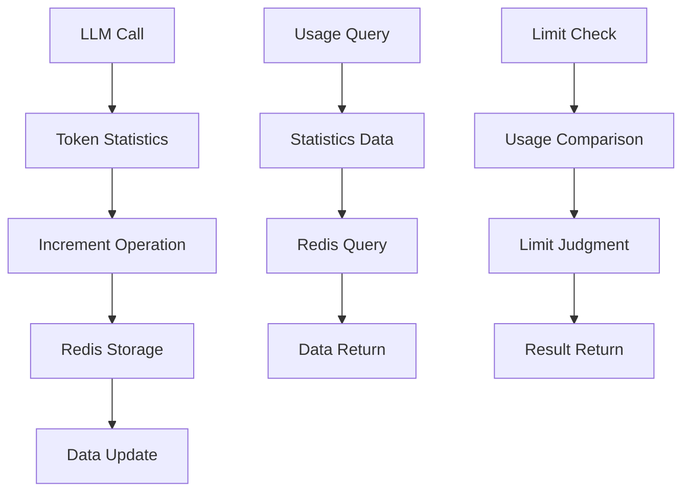
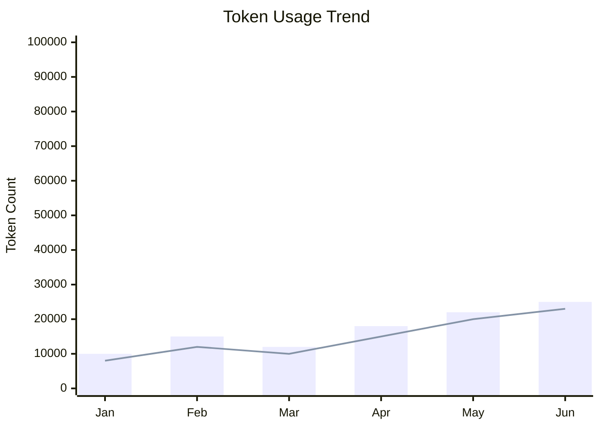
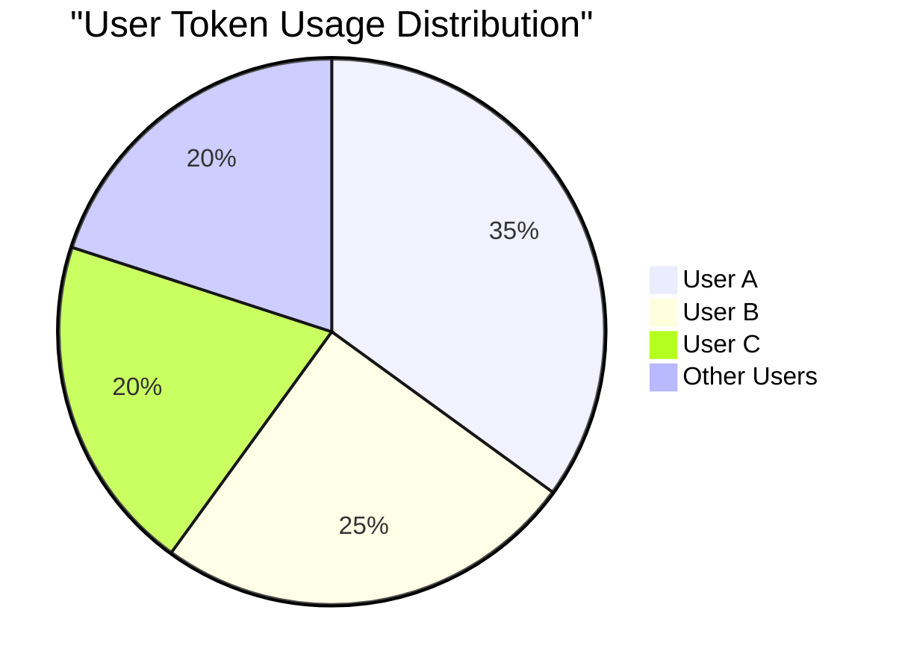

# Token Usage Repository Technical Documentation

## 1. Overview

**Purpose**: `token_usage_repository.py` is the core data access layer component in the AIECS system responsible for token usage statistics and management. This module provides high-performance token usage storage, querying, limit checking, and other functionalities through Redis, providing a reliable data foundation for cost control, usage monitoring, and user management across the entire system.

**Core Value**:
- **Precise Statistics**: Real-time recording of user prompt tokens, completion tokens, and total usage
- **High-Performance Storage**: Redis-based atomic operations, supporting high-concurrency access
- **Flexible Billing**: Support custom billing cycles and usage limits
- **Cost Control**: Provide usage limit checking to prevent excessive usage
- **Data Consistency**: Use Redis atomic operations to ensure data accuracy

## 2. Problem Background & Design Motivation

### 2.1 Business Pain Points

During AIECS system development, we face the following key challenges:

1. **Cost Control Challenges**: LLM API calls are expensive, requiring precise statistics of each user's token usage
2. **Missing Usage Monitoring**: Lack of real-time monitoring and analysis of user usage
3. **Billing Cycle Confusion**: Different users may have different billing cycles, requiring flexible support
4. **Excessive Usage Risk**: Lack of usage limit mechanism may lead to unexpected cost overruns
5. **Data Consistency Issues**: Data race and consistency issues in high-concurrency scenarios
6. **Performance Bottlenecks**: Traditional databases cannot meet high-frequency token statistics requirements

### 2.2 Design Motivation

Based on the above pain points, we designed a Redis-based token usage repository:

- **High-Performance Storage**: Use Redis to provide millisecond-level read/write performance
- **Atomic Operations**: Use Redis HINCRBY to ensure data consistency
- **Flexible Billing**: Support custom billing cycles and usage limits
- **Real-Time Monitoring**: Provide real-time usage queries and limit checking
- **Cost Control**: Prevent excessive usage through usage limits

## 3. Architecture Positioning & Context

### 3.1 System Architecture Diagram



### 3.2 Upstream and Downstream Dependencies

**Upstream Callers**:
- `CustomAsyncCallbackHandler`: LLM callback handler, records token usage
- Business Service Layer: Needs to query user usage statistics
- Monitoring System: Needs to get usage data for alerts

**Downstream Dependencies**:
- `RedisClient`: Redis client, provides data storage capability
- Redis Server: Provides high-performance data storage and atomic operations
- Logging System: Records operation logs and error information

**Peer Components**:
- Configuration Management: Provides Redis connection configuration
- Error Handling: Handles Redis connection and operation exceptions

### 3.3 Data Flow



## 4. Core Features & Use Cases

### 4.1 Precise Token Statistics

**Function Description**: Real-time recording and statistics of user prompt tokens, completion tokens, and total usage.

**Core Features**:
- Support separate statistics for prompt and completion tokens
- Automatically calculate total usage
- Redis-based atomic operations ensure data consistency
- Support custom billing cycles

**Use Cases**:
```python
from aiecs.utils.token_usage_repository import token_usage_repo

# Record detailed token usage
await token_usage_repo.increment_detailed_usage(
    user_id="user_123",
    prompt_tokens=150,
    completion_tokens=75,
    cycle_start_date="2024-01-01"
)

# Record total usage
await token_usage_repo.increment_total_usage(
    user_id="user_123",
    total_tokens=225,
    cycle_start_date="2024-01-01"
)

# Record prompt and completion tokens separately
await token_usage_repo.increment_prompt_tokens(
    user_id="user_123",
    prompt_tokens=150
)

await token_usage_repo.increment_completion_tokens(
    user_id="user_123",
    completion_tokens=75
)
```

**Real-world Application Cases**:
- **Cost Accounting**: Precisely calculate each user's API call costs
- **Usage Analysis**: Analyze user usage patterns and trends
- **Resource Optimization**: Optimize resource allocation based on usage data
- **Billing System**: Provide accurate usage data for billing systems

### 4.2 Usage Limit Management

**Function Description**: Set usage limits for users and provide real-time limit checking functionality.

**Core Features**:
- Support user-level usage limit settings
- Real-time checking if limits are exceeded
- Provide remaining usage queries
- Support limit settings for different billing cycles

**Use Cases**:
```python
# Set user usage limit
await token_usage_repo.set_usage_limit(
    user_id="user_123",
    limit=10000,  # 10K tokens
    cycle_start_date="2024-01-01"
)

# Check usage limit
limit_check = await token_usage_repo.check_usage_limit(
    user_id="user_123",
    cycle_start_date="2024-01-01"
)

if limit_check["exceeded"]:
    print(f"User has exceeded limit! Current usage: {limit_check['current_usage']}, Limit: {limit_check['limit']}")
else:
    print(f"Remaining usage: {limit_check['remaining']} tokens")

# Check limit before LLM call
async def call_llm_with_limit_check(user_id: str, prompt: str):
    limit_check = await token_usage_repo.check_usage_limit(user_id)
    
    if limit_check["exceeded"]:
        raise Exception("User usage has exceeded limit")
    
    # Continue LLM call
    return await llm_client.generate_text(prompt)
```

**Real-world Application Cases**:
- **Cost Control**: Prevent users from excessive usage causing cost overruns
- **Resource Management**: Reasonably allocate system resources
- **User Management**: Set different usage limits for different users
- **Alert System**: Send alerts when usage approaches limits

### 4.3 Usage Query and Statistics

**Function Description**: Provide rich usage query and statistics functionality, supporting monitoring and analysis.

**Core Features**:
- Query usage statistics for specified users
- Support data queries for different billing cycles
- Provide detailed usage breakdown
- Support batch queries and aggregate statistics

**Use Cases**:
```python
# Get user usage statistics
stats = await token_usage_repo.get_usage_stats(
    user_id="user_123",
    cycle_start_date="2024-01-01"
)

print(f"Prompt tokens: {stats['prompt_tokens']}")
print(f"Completion tokens: {stats['completion_tokens']}")
print(f"Total tokens: {stats['total_tokens']}")

# Batch query usage for multiple users
async def get_batch_usage_stats(user_ids: List[str]):
    results = {}
    for user_id in user_ids:
        stats = await token_usage_repo.get_usage_stats(user_id)
        results[user_id] = stats
    return results

# Calculate usage rate
def calculate_usage_rate(stats: Dict[str, int], limit: int) -> float:
    total_usage = stats.get("total_tokens", 0)
    return (total_usage / limit) * 100 if limit > 0 else 0
```

**Real-world Application Cases**:
- **User Dashboard**: Provide usage overview for users
- **Administrator Monitoring**: Monitor overall system usage
- **Cost Analysis**: Analyze cost distribution across different users and services
- **Trend Analysis**: Analyze usage change trends

### 4.4 Data Reset and Management

**Function Description**: Provide data reset and management functionality, supporting billing cycle reset and abnormal data cleanup.

**Core Features**:
- Support resetting user usage data
- Support reset by billing cycle
- Provide data cleanup and repair functionality
- Support batch operations

**Use Cases**:
```python
# Reset user usage (new billing cycle starts)
await token_usage_repo.reset_usage(
    user_id="user_123",
    cycle_start_date="2024-02-01"  # New billing cycle
)

# Batch reset usage for multiple users
async def reset_batch_usage(user_ids: List[str], new_cycle: str):
    for user_id in user_ids:
        await token_usage_repo.reset_usage(user_id, new_cycle)

# Data repair: Clean abnormal data
async def cleanup_abnormal_data(user_id: str):
    stats = await token_usage_repo.get_usage_stats(user_id)
    
    # Check for data anomalies
    if stats["total_tokens"] < 0:
        logger.warning(f"Found abnormal data: {stats}")
        await token_usage_repo.reset_usage(user_id)
```

**Real-world Application Cases**:
- **Billing Cycle Reset**: Monthly reset of user usage
- **Data Repair**: Repair abnormal or corrupted data
- **Test Environment Cleanup**: Clean test data
- **User Migration**: Migrate user data to new billing cycle

## 5. API Reference

### 5.1 TokenUsageRepository Class

#### Constructor
```python
def __init__(self)
```

**Function**: Initialize token usage repository
**Parameters**: None
**Returns**: `TokenUsageRepository` instance

#### Methods

##### increment_prompt_tokens
```python
async def increment_prompt_tokens(self, user_id: str, prompt_tokens: int, cycle_start_date: Optional[str] = None)
```

**Function**: Increment user's prompt token usage
**Parameters**:
- `user_id` (str, required): User ID
- `prompt_tokens` (int, required): Number of prompt tokens to increment
- `cycle_start_date` (Optional[str], optional): Billing cycle start date, format "YYYY-MM-DD"

**Returns**: `None`

**Exceptions**:
- `Exception`: When Redis operation fails

**Usage Example**:
```python
await token_usage_repo.increment_prompt_tokens("user_123", 150)
```

##### increment_completion_tokens
```python
async def increment_completion_tokens(self, user_id: str, completion_tokens: int, cycle_start_date: Optional[str] = None)
```

**Function**: Increment user's completion token usage
**Parameters**:
- `user_id` (str, required): User ID
- `completion_tokens` (int, required): Number of completion tokens to increment
- `cycle_start_date` (Optional[str], optional): Billing cycle start date

**Returns**: `None`

**Exceptions**:
- `Exception`: When Redis operation fails

##### increment_total_usage
```python
async def increment_total_usage(self, user_id: str, total_tokens: int, cycle_start_date: Optional[str] = None)
```

**Function**: Increment user's total token usage
**Parameters**:
- `user_id` (str, required): User ID
- `total_tokens` (int, required): Number of total tokens to increment
- `cycle_start_date` (Optional[str], optional): Billing cycle start date

**Returns**: `None`

**Exceptions**:
- `Exception`: When Redis operation fails

##### increment_detailed_usage
```python
async def increment_detailed_usage(
    self,
    user_id: str,
    prompt_tokens: int,
    completion_tokens: int,
    cycle_start_date: Optional[str] = None
)
```

**Function**: Increment both user's prompt and completion token usage simultaneously
**Parameters**:
- `user_id` (str, required): User ID
- `prompt_tokens` (int, required): Number of prompt tokens to increment
- `completion_tokens` (int, required): Number of completion tokens to increment
- `cycle_start_date` (Optional[str], optional): Billing cycle start date

**Returns**: `None`

**Exceptions**:
- `Exception`: When Redis operation fails

**Usage Example**:
```python
await token_usage_repo.increment_detailed_usage(
    user_id="user_123",
    prompt_tokens=150,
    completion_tokens=75,
    cycle_start_date="2024-01-01"
)
```

##### get_usage_stats
```python
async def get_usage_stats(self, user_id: str, cycle_start_date: Optional[str] = None) -> Dict[str, int]
```

**Function**: Get user usage statistics
**Parameters**:
- `user_id` (str, required): User ID
- `cycle_start_date` (Optional[str], optional): Billing cycle start date

**Returns**:
- `Dict[str, int]`: Dictionary containing the following keys:
  - `prompt_tokens`: Prompt token usage
  - `completion_tokens`: Completion token usage
  - `total_tokens`: Total token usage

**Exceptions**:
- No direct exceptions, returns default values on error

**Usage Example**:
```python
stats = await token_usage_repo.get_usage_stats("user_123")
print(f"Total usage: {stats['total_tokens']}")
```

##### reset_usage
```python
async def reset_usage(self, user_id: str, cycle_start_date: Optional[str] = None)
```

**Function**: Reset user usage data
**Parameters**:
- `user_id` (str, required): User ID
- `cycle_start_date` (Optional[str], optional): Billing cycle start date

**Returns**: `None`

**Exceptions**:
- `Exception`: When Redis operation fails

##### set_usage_limit
```python
async def set_usage_limit(self, user_id: str, limit: int, cycle_start_date: Optional[str] = None)
```

**Function**: Set user usage limit
**Parameters**:
- `user_id` (str, required): User ID
- `limit` (int, required): Usage limit (number of tokens)
- `cycle_start_date` (Optional[str], optional): Billing cycle start date

**Returns**: `None`

**Exceptions**:
- `Exception`: When Redis operation fails

##### check_usage_limit
```python
async def check_usage_limit(self, user_id: str, cycle_start_date: Optional[str] = None) -> Dict[str, Any]
```

**Function**: Check if user has exceeded usage limit
**Parameters**:
- `user_id` (str, required): User ID
- `cycle_start_date` (Optional[str], optional): Billing cycle start date

**Returns**:
- `Dict[str, Any]`: Dictionary containing the following keys:
  - `exceeded`: Whether limit is exceeded (bool)
  - `current_usage`: Current usage (int)
  - `limit`: Set limit (int)
  - `remaining`: Remaining usage (int or float('inf'))

**Exceptions**:
- No direct exceptions, returns default values on error

**Usage Example**:
```python
limit_check = await token_usage_repo.check_usage_limit("user_123")
if limit_check["exceeded"]:
    print("User has exceeded limit")
else:
    print(f"Remaining usage: {limit_check['remaining']}")
```

### 5.2 Global Instance

#### token_usage_repo
```python
token_usage_repo = TokenUsageRepository()
```

**Function**: Global singleton instance for use throughout the application
**Type**: `TokenUsageRepository`

**Usage Example**:
```python
from aiecs.utils.token_usage_repository import token_usage_repo

# Use global instance directly
await token_usage_repo.increment_total_usage("user_123", 100)
```

## 6. Technical Implementation Details

### 6.1 Redis Key Design

**Key Format**:
```python
def _get_key_for_current_period(self, user_id: str, cycle_start_date: Optional[str] = None) -> str:
    if cycle_start_date:
        period = cycle_start_date
    else:
        period = datetime.now().strftime("%Y-%m-%d")
    
    return f"token_usage:{user_id}:{period}"
```

**Key Structure Explanation**:
- `token_usage`: Fixed prefix, identifies token usage data
- `{user_id}`: User ID, ensures data isolation
- `{period}`: Billing cycle, supports multiple cycle data coexistence

**Hash Field Design**:
```python
# Redis Hash fields
{
    "prompt_tokens": "150",      # Prompt token usage
    "completion_tokens": "75",   # Completion token usage
    "total_tokens": "225",       # Total token usage
    "usage_limit": "10000"       # Usage limit (optional)
}
```

### 6.2 Atomic Operation Mechanism

**HINCRBY Operation**:
```python
# Use Redis HINCRBY to ensure atomicity
await client.hincrby(redis_key, "prompt_tokens", prompt_tokens)
await client.hincrby(redis_key, "completion_tokens", completion_tokens)
await client.hincrby(redis_key, "total_tokens", total_tokens)
```

**Pipeline Batch Operations**:
```python
# Use Pipeline for batch atomic operations
pipe = client.pipeline()
for field, value in updates.items():
    pipe.hincrby(redis_key, field, value)
await pipe.execute()
```

**Advantages**:
- Ensure data consistency
- Support high-concurrency access
- Reduce network round trips

### 6.3 Error Handling Mechanism

**Layered Error Handling**:
```python
async def increment_detailed_usage(self, user_id: str, prompt_tokens: int, completion_tokens: int, cycle_start_date: Optional[str] = None):
    try:
        # Parameter validation
        if not user_id or (prompt_tokens <= 0 and completion_tokens <= 0):
            return
        
        # Redis operations
        # ... execute operations
        
    except Exception as e:
        logger.error(f"Failed to increment detailed usage for user {user_id}: {e}")
        raise  # Re-raise exception for caller to handle
```

**Error Type Handling**:
- Parameter validation errors: Return directly, don't execute operation
- Redis connection errors: Log error and re-raise
- Data format errors: Log error and return default value

### 6.4 Performance Optimization Strategies

**Connection Pool Management**:
```python
# Use Redis connection pool
self._connection_pool = redis.ConnectionPool(
    host=redis_host,
    port=redis_port,
    db=redis_db,
    password=redis_password,
    decode_responses=True,
    max_connections=20,
    retry_on_timeout=True
)
```

**Batch Operation Optimization**:
```python
# Batch update multiple fields
updates = {}
if prompt_tokens > 0:
    updates["prompt_tokens"] = prompt_tokens
if completion_tokens > 0:
    updates["completion_tokens"] = completion_tokens

# Use Pipeline for batch execution
pipe = client.pipeline()
for field, value in updates.items():
    pipe.hincrby(redis_key, field, value)
await pipe.execute()
```

**Data Validation Optimization**:
```python
# Early validation to avoid invalid operations
if not user_id or prompt_tokens <= 0:
    return

# Type conversion optimization
result = {}
for key, value in stats.items():
    try:
        result[key] = int(value) if value else 0
    except (ValueError, TypeError):
        result[key] = 0
```

### 6.5 Data Consistency Guarantees

**Atomic Operations**:
- Use Redis HINCRBY to ensure atomicity of single field
- Use Pipeline to ensure atomicity of multiple fields

**Data Validation**:
```python
# Ensure required fields exist
result.setdefault("prompt_tokens", 0)
result.setdefault("completion_tokens", 0)
result.setdefault("total_tokens", 0)
```

**Error Recovery**:
```python
# Provide default values to ensure system stability
except Exception as e:
    logger.error(f"Failed to get usage stats for user {user_id}: {e}")
    return {
        "prompt_tokens": 0,
        "completion_tokens": 0,
        "total_tokens": 0
    }
```

## 7. Configuration & Deployment

### 7.1 Environment Requirements

**Python Version**:
- Python 3.8+ (Python 3.9+ recommended)
- Support `asyncio` asynchronous programming
- Support `typing` type annotations

**Dependencies**:
```python
# requirements.txt
redis>=4.5.0          # Redis client
asyncio>=3.4.3        # Asynchronous programming support
```

**Redis Requirements**:
- Redis 6.0+ (Redis 7.0+ recommended)
- Support Hash data type
- Support HINCRBY operation

### 7.2 Environment Variable Configuration

**Redis Connection Configuration**:
```bash
# .env
REDIS_HOST=localhost
REDIS_PORT=6379
REDIS_DB=0
REDIS_PASSWORD=your_password
REDIS_MAX_CONNECTIONS=20
REDIS_RETRY_ON_TIMEOUT=true
```

**Token Statistics Configuration**:
```bash
# Token statistics related configuration
TOKEN_STATS_ENABLED=true
TOKEN_STATS_DEFAULT_CYCLE=monthly
TOKEN_STATS_CLEANUP_INTERVAL=3600
TOKEN_STATS_BATCH_SIZE=100
```

### 7.3 Deployment Configuration

**Docker Configuration**:
```dockerfile
FROM python:3.9-slim

WORKDIR /app

# Install dependencies
COPY requirements.txt .
RUN pip install --no-cache-dir -r requirements.txt

# Copy code
COPY aiecs/ ./aiecs/

# Set environment variables
ENV REDIS_HOST=redis
ENV REDIS_PORT=6379
ENV TOKEN_STATS_ENABLED=true

# Run application
CMD ["python", "-m", "aiecs.utils.token_usage_repository"]
```

**Kubernetes Configuration**:
```yaml
apiVersion: apps/v1
kind: Deployment
metadata:
  name: aiecs-token-repository
spec:
  replicas: 3
  selector:
    matchLabels:
      app: aiecs-token-repository
  template:
    metadata:
      labels:
        app: aiecs-token-repository
    spec:
      containers:
      - name: token-repository
        image: aiecs/token-repository:latest
        env:
        - name: REDIS_HOST
          value: "redis-service"
        - name: REDIS_PORT
          value: "6379"
        - name: TOKEN_STATS_ENABLED
          value: "true"
        resources:
          requests:
            memory: "128Mi"
            cpu: "100m"
          limits:
            memory: "256Mi"
            cpu: "200m"
```

### 7.4 Monitoring Configuration

**Prometheus Metrics**:
```python
from prometheus_client import Counter, Histogram, Gauge

# Define monitoring metrics
token_increments_total = Counter('token_increments_total', 'Total token increments', ['user_id', 'token_type'])
token_queries_total = Counter('token_queries_total', 'Total token queries', ['user_id'])
token_operations_duration_seconds = Histogram('token_operations_duration_seconds', 'Token operation duration')
redis_operations_total = Counter('redis_operations_total', 'Total Redis operations', ['operation_type', 'status'])
```

**Health Check**:
```python
async def health_check():
    """Token usage repository health check"""
    try:
        # Test Redis connection
        redis_client = await get_redis_client()
        await redis_client.ping()
        
        # Test basic operations
        test_user = "health_check_test"
        await token_usage_repo.increment_total_usage(test_user, 1)
        stats = await token_usage_repo.get_usage_stats(test_user)
        await token_usage_repo.reset_usage(test_user)
        
        return {
            "status": "healthy",
            "timestamp": time.time(),
            "version": "1.0.0"
        }
    except Exception as e:
        return {"status": "unhealthy", "error": str(e)}
```

## 8. Maintenance & Troubleshooting

### 8.1 Monitoring Metrics

**Key Metrics**:
- Token increment operation success rate
- Query operation response time
- Redis connection status
- Data consistency checks

**Monitoring Dashboard**:
```python
# Grafana query examples
# Token increment success rate
rate(token_increments_total[5m])

# Average operation time
histogram_quantile(0.95, rate(token_operations_duration_seconds_bucket[5m]))

# Redis operation success rate
rate(redis_operations_total{status="success"}[5m]) / rate(redis_operations_total[5m])
```

### 8.2 Common Issues & Solutions

#### 8.2.1 Redis Connection Failure

**Symptoms**:
- "Failed to initialize Redis client" error in logs
- Token statistics operations fail
- System functionality limited

**Troubleshooting Steps**:
1. Check Redis service status: `redis-cli ping`
2. Verify network connection: `telnet redis_host 6379`
3. Check authentication: Verify password and permissions
4. View Redis logs: `tail -f /var/log/redis/redis.log`

**Solutions**:
```python
# Add connection retry mechanism
class ResilientTokenRepository(TokenUsageRepository):
    def __init__(self, max_retries=3, retry_delay=1):
        super().__init__()
        self.max_retries = max_retries
        self.retry_delay = retry_delay
    
    async def _execute_with_retry(self, operation, *args, **kwargs):
        """Execute operation with retry"""
        for attempt in range(self.max_retries):
            try:
                return await operation(*args, **kwargs)
            except Exception as e:
                if attempt == self.max_retries - 1:
                    raise
                logger.warning(f"Operation failed, retrying {attempt + 1}/{self.max_retries}: {e}")
                await asyncio.sleep(self.retry_delay * (2 ** attempt))
```

#### 8.2.2 Data Inconsistency

**Symptoms**:
- Statistics data inaccurate
- Different queries return different results
- Data shows negative values

**Troubleshooting Steps**:
1. Check concurrent operations: See if multiple processes are operating simultaneously
2. Verify Redis data: Query data directly in Redis
3. Analyze operation logs: Find abnormal operation records

**Solutions**:
```python
# Data consistency check tool
async def verify_data_consistency(user_id: str, cycle_start_date: str = None):
    """Verify data consistency"""
    try:
        # Get statistics data
        stats = await token_usage_repo.get_usage_stats(user_id, cycle_start_date)
        
        # Verify data consistency
        calculated_total = stats.get("prompt_tokens", 0) + stats.get("completion_tokens", 0)
        stored_total = stats.get("total_tokens", 0)
        
        if calculated_total != stored_total:
            logger.warning(f"Data inconsistency: calculated total {calculated_total} != stored total {stored_total}")
            
            # Repair data
            await token_usage_repo.increment_total_usage(
                user_id, 
                calculated_total - stored_total, 
                cycle_start_date
            )
            
        return True
    except Exception as e:
        logger.error(f"Data consistency check failed: {e}")
        return False
```

#### 8.2.3 Performance Issues

**Symptoms**:
- Token statistics operations respond slowly
- Redis operations timeout
- Overall system performance degrades

**Troubleshooting Steps**:
1. Analyze operation time: Use performance profiling tools
2. Check Redis performance: Monitor Redis CPU and memory usage
3. Optimize batch operations: Reduce network round trips

**Solutions**:
```python
# Performance optimized version
class OptimizedTokenRepository(TokenUsageRepository):
    def __init__(self, batch_size=100, cache_ttl=300):
        super().__init__()
        self.batch_size = batch_size
        self.cache_ttl = cache_ttl
        self._cache = {}
    
    async def batch_increment_usage(self, operations: List[Dict]):
        """Batch increment usage"""
        # Group by user
        user_operations = {}
        for op in operations:
            user_id = op["user_id"]
            if user_id not in user_operations:
                user_operations[user_id] = []
            user_operations[user_id].append(op)
        
        # Batch execute
        tasks = []
        for user_id, ops in user_operations.items():
            task = self._batch_process_user(user_id, ops)
            tasks.append(task)
        
        await asyncio.gather(*tasks)
    
    async def _batch_process_user(self, user_id: str, operations: List[Dict]):
        """Batch process operations for single user"""
        total_prompt = sum(op.get("prompt_tokens", 0) for op in operations)
        total_completion = sum(op.get("completion_tokens", 0) for op in operations)
        
        if total_prompt > 0 or total_completion > 0:
            await self.increment_detailed_usage(
                user_id, total_prompt, total_completion
            )
```

### 8.3 Data Backup and Recovery

**Backup Strategy**:
```bash
# Redis data backup
redis-cli --rdb /backup/token_usage_$(date +%Y%m%d).rdb

# Regular backup script
#!/bin/bash
DATE=$(date +%Y%m%d_%H%M%S)
redis-cli --rdb /backup/token_usage_$DATE.rdb
gzip /backup/token_usage_$DATE.rdb
```

**Recovery Process**:
```bash
# Stop Redis service
systemctl stop redis

# Restore data
gunzip /backup/token_usage_20240101_120000.rdb.gz
cp /backup/token_usage_20240101_120000.rdb /var/lib/redis/dump.rdb

# Start Redis service
systemctl start redis
```

### 8.4 Log Analysis

**Log Configuration**:
```python
import logging

# Configure token repository logs
token_logger = logging.getLogger('aiecs.token_usage_repository')
token_logger.setLevel(logging.INFO)

# Add file handler
file_handler = logging.FileHandler('/var/log/aiecs/token_usage.log')
file_handler.setFormatter(logging.Formatter(
    '%(asctime)s - %(name)s - %(levelname)s - %(message)s'
))
token_logger.addHandler(file_handler)
```

**Key Log Patterns**:
```bash
# Find error logs
grep "ERROR" /var/log/aiecs/token_usage.log | tail -100

# Analyze performance issues
grep "duration" /var/log/aiecs/token_usage.log

# Monitor usage changes
grep "incremented by" /var/log/aiecs/token_usage.log | tail -50
```

## 9. Visualizations

### 9.1 System Architecture Diagram


### 9.2 Data Flow Diagram



### 9.3 Token Usage Trend Chart



### 9.4 User Usage Distribution Chart



## 10. Version History

### v1.0.0 (2024-01-15)
**New Features**:
- Implement basic `TokenUsageRepository` class
- Support separate statistics for prompt and completion tokens
- Implement total usage statistics
- Add Redis atomic operation support

**Technical Features**:
- Redis Hash-based data storage
- Use HINCRBY to ensure atomicity
- Support custom billing cycles
- Complete error handling mechanism

### v1.1.0 (2024-02-01)
**New Features**:
- Implement detailed usage statistics (increment_detailed_usage)
- Add usage limit management functionality
- Implement usage query and statistics
- Add data reset functionality

**Improvements**:
- Optimize Redis operation performance
- Enhance error handling mechanism
- Add detailed log recording
- Improve data validation logic

### v1.2.0 (2024-03-01)
**New Features**:
- Implement Pipeline batch operations
- Add data consistency checks
- Support batch queries and operations
- Add performance monitoring metrics

**Performance Optimizations**:
- Use Pipeline to reduce network round trips
- Optimize data validation logic
- Add connection pool management
- Improve concurrent processing capability

### v1.3.0 (2024-04-01) [Planned]
**Planned Features**:
- Support distributed Redis cluster
- Add data sharding functionality
- Implement real-time data synchronization
- Support multi-tenant data isolation

**Performance Goals**:
- Operation latency < 10ms
- Support 10000+ concurrent operations
- 99.9% availability guarantee
- 100% data consistency

---

## Appendix

### A. Related Documentation Links
- [Redis Client Documentation](../INFRASTRUCTURE_PERSISTENCE/REDIS_CLIENT.md)
- [LLM Callback Handler Documentation](../LLM/LLM_CUSTOM_CALLBACKS.md)
- [Global Metrics Manager Documentation](../INFRASTRUCTURE_MONITORING/GLOBAL_METRICS_MANAGER.md)

### B. Example Code Repositories
- [Complete Example Project](https://github.com/aiecs/examples)
- [Performance Test Scripts](https://github.com/aiecs/performance-tests)
- [Monitoring Configuration Templates](https://github.com/aiecs/monitoring-configs)

### C. Technical Support
- Technical Documentation: https://docs.aiecs.com
- Issue Reporting: https://github.com/aiecs/issues
- Community Discussion: https://discord.gg/aiecs

### D. Best Practices

#### D.1 Usage Statistics Best Practices
```python
# Batch statistics best practices
class TokenUsageManager:
    """Token usage manager"""
    
    def __init__(self):
        self.repository = TokenUsageRepository()
        self.batch_queue = []
        self.batch_size = 100
        self.flush_interval = 30  # 30 seconds
    
    async def record_usage(self, user_id: str, prompt_tokens: int, completion_tokens: int):
        """Record usage"""
        self.batch_queue.append({
            "user_id": user_id,
            "prompt_tokens": prompt_tokens,
            "completion_tokens": completion_tokens,
            "timestamp": time.time()
        })
        
        if len(self.batch_queue) >= self.batch_size:
            await self.flush_batch()
    
    async def flush_batch(self):
        """Flush batch data"""
        if not self.batch_queue:
            return
        
        # Group by user
        user_operations = {}
        for op in self.batch_queue:
            user_id = op["user_id"]
            if user_id not in user_operations:
                user_operations[user_id] = {"prompt_tokens": 0, "completion_tokens": 0}
            
            user_operations[user_id]["prompt_tokens"] += op["prompt_tokens"]
            user_operations[user_id]["completion_tokens"] += op["completion_tokens"]
        
        # Batch update
        tasks = []
        for user_id, tokens in user_operations.items():
            task = self.repository.increment_detailed_usage(
                user_id, tokens["prompt_tokens"], tokens["completion_tokens"]
            )
            tasks.append(task)
        
        await asyncio.gather(*tasks)
        self.batch_queue.clear()
```

#### D.2 Usage Limit Best Practices
```python
# Usage limit management best practices
class UsageLimitManager:
    """Usage limit manager"""
    
    def __init__(self):
        self.repository = TokenUsageRepository()
        self.limit_cache = {}
        self.cache_ttl = 300  # 5 minutes
    
    async def check_and_enforce_limit(self, user_id: str, requested_tokens: int) -> bool:
        """Check and enforce usage limit"""
        # Check cache
        cache_key = f"limit_{user_id}"
        if cache_key in self.limit_cache:
            cached_data = self.limit_cache[cache_key]
            if time.time() - cached_data["timestamp"] < self.cache_ttl:
                limit_info = cached_data["data"]
            else:
                del self.limit_cache[cache_key]
                limit_info = await self.repository.check_usage_limit(user_id)
        else:
            limit_info = await self.repository.check_usage_limit(user_id)
            self.limit_cache[cache_key] = {
                "data": limit_info,
                "timestamp": time.time()
            }
        
        # Check if limit exceeded
        if limit_info["exceeded"]:
            return False
        
        # Check if request would exceed limit
        if limit_info["limit"] > 0:
            if limit_info["current_usage"] + requested_tokens > limit_info["limit"]:
                return False
        
        return True
    
    async def set_user_limit(self, user_id: str, limit: int, cycle_start_date: str = None):
        """Set user limit"""
        await self.repository.set_usage_limit(user_id, limit, cycle_start_date)
        
        # Clear cache
        cache_key = f"limit_{user_id}"
        if cache_key in self.limit_cache:
            del self.limit_cache[cache_key]
```

#### D.3 Monitoring and Alerting Best Practices
```python
# Monitoring and alerting best practices
class TokenUsageMonitor:
    """Token usage monitor"""
    
    def __init__(self):
        self.repository = TokenUsageRepository()
        self.alert_thresholds = {
            "high_usage": 0.8,  # 80% usage rate alert
            "critical_usage": 0.95,  # 95% usage rate critical alert
            "limit_exceeded": 1.0  # 100% usage rate exceeded alert
        }
    
    async def check_usage_alerts(self, user_id: str) -> List[Dict]:
        """Check usage alerts"""
        alerts = []
        
        try:
            limit_check = await self.repository.check_usage_limit(user_id)
            
            if limit_check["limit"] == 0:
                return alerts  # No limit, don't check alerts
            
            usage_rate = limit_check["current_usage"] / limit_check["limit"]
            
            if usage_rate >= self.alert_thresholds["limit_exceeded"]:
                alerts.append({
                    "level": "critical",
                    "message": f"User {user_id} has exceeded usage limit",
                    "usage_rate": usage_rate,
                    "current_usage": limit_check["current_usage"],
                    "limit": limit_check["limit"]
                })
            elif usage_rate >= self.alert_thresholds["critical_usage"]:
                alerts.append({
                    "level": "warning",
                    "message": f"User {user_id} usage approaching limit",
                    "usage_rate": usage_rate,
                    "remaining": limit_check["remaining"]
                })
            elif usage_rate >= self.alert_thresholds["high_usage"]:
                alerts.append({
                    "level": "info",
                    "message": f"User {user_id} has high usage",
                    "usage_rate": usage_rate,
                    "remaining": limit_check["remaining"]
                })
            
        except Exception as e:
            logger.error(f"Failed to check usage alerts: {e}")
            alerts.append({
                "level": "error",
                "message": f"Error checking usage alerts for user {user_id}: {e}"
            })
        
        return alerts
```
