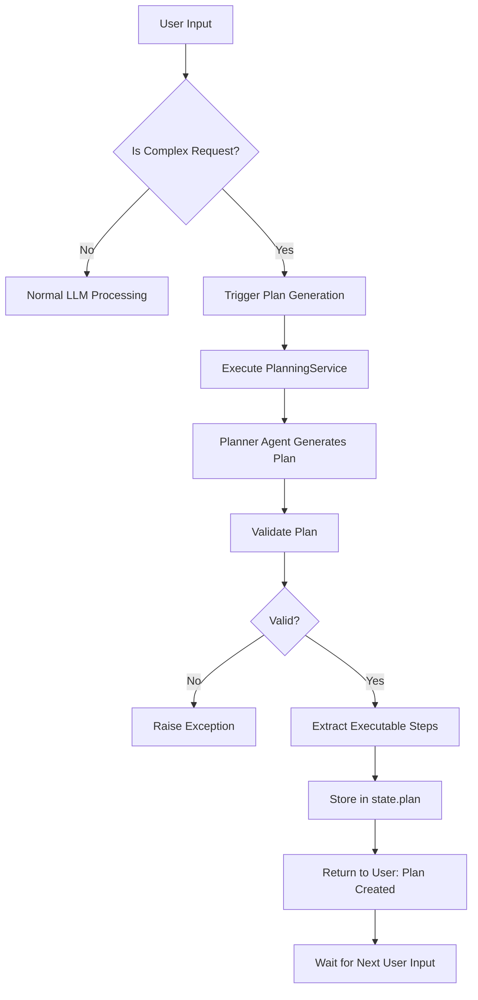
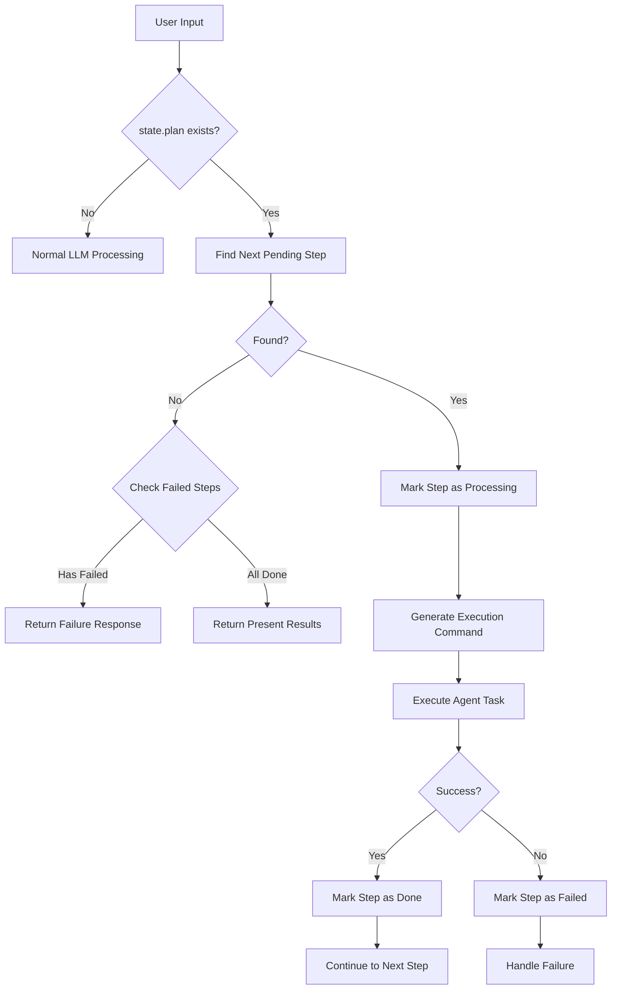

# 增强MasterController感知计划 - 架构图与流程图

## 目录

1. [整体架构图](#整体架构图)
2. [数据流向图](#数据流向图)
3. [计划生成流程](#计划生成流程)
4. [计划执行流程](#计划执行流程)
5. [状态转换图](#状态转换图)
6. [错误处理流程](#错误处理流程)

---

## 整体架构图

```
┌─────────────────────────────────────────────────────────────────┐
│                         User Interface                          │
└────────────────────────────┬────────────────────────────────────┘
                             │
                             ▼
┌─────────────────────────────────────────────────────────────────┐
│                      MasterController                           │
│  ┌──────────────────────────────────────────────────────────┐  │
│  │  process_user_input()                                     │  │
│  │    ├─ _is_complex_request()  ← 新增                      │  │
│  │    ├─ _follow_plan()          ← 新增                      │  │
│  │    └─ _should_regenerate_plan() ← 新增                   │  │
│  └──────────────────────────────────────────────────────────┘  │
└────────────────────────────┬────────────────────────────────────┘
                             │ ControllerResponse
                             │ {command, conversation_response}
                             ▼
┌─────────────────────────────────────────────────────────────────┐
│                         Summarizer                              │
│  ┌──────────────────────────────────────────────────────────┐  │
│  │  _execute_special_agent_service_node_unified()            │  │
│  │    └─ planning branch                                     │  │
│  │       ├─ _execute_planning_service()                      │  │
│  │       └─ _extract_executable_plan() ← 新增               │  │
│  │          ├─ _convert_sequence_to_plan() ← 新增           │  │
│  │          └─ _parse_dsl_to_plan() ← 新增                  │  │
│  └──────────────────────────────────────────────────────────┘  │
│  ┌──────────────────────────────────────────────────────────┐  │
│  │  _execute_agent_node_unified()                            │  │
│  │    └─ _update_plan_status() ← 新增                       │  │
│  └──────────────────────────────────────────────────────────┘  │
└────────────────────────────┬────────────────────────────────────┘
                             │
                             ▼
┌─────────────────────────────────────────────────────────────────┐
│                      PlanningService                            │
│  ┌──────────────────────────────────────────────────────────┐  │
│  │  execute(command="plan_sequence")                         │  │
│  │    ├─ _decompose_tasks_node()                             │  │
│  │    ├─ _plan_sequence_node()                               │  │
│  │    └─ _validate_plan_node()                               │  │
│  └──────────────────────────────────────────────────────────┘  │
└────────────────────────────┬────────────────────────────────────┘
                             │
                             ▼
┌─────────────────────────────────────────────────────────────────┐
│                      SummarizerState                            │
│  ┌──────────────────────────────────────────────────────────┐  │
│  │  Fields:                                                   │  │
│  │    ├─ mining_result: Optional[Dict]      ← 新增          │  │
│  │    ├─ planning_result: Optional[Dict]    ← 新增          │  │
│  │    └─ plan: Optional[List[Dict]]         ← 新增          │  │
│  │       Format:                                              │  │
│  │       [                                                    │  │
│  │         {                                                  │  │
│  │           "id": "step_1",                                  │  │
│  │           "action": "execute_researcher_task",            │  │
│  │           "params": {...},                                 │  │
│  │           "status": "pending|processing|done|failed",     │  │
│  │           "description": "...",                            │  │
│  │           "dependencies": []                               │  │
│  │         }                                                  │  │
│  │       ]                                                    │  │
│  └──────────────────────────────────────────────────────────┘  │
└─────────────────────────────────────────────────────────────────┘
```

---

## 数据流向图

### 计划生成阶段

```
User Input
    │
    ▼
┌─────────────────────┐
│ MasterController    │
│ _is_complex_request │  ──Yes──┐
└─────────────────────┘         │
                                ▼
                    ┌──────────────────────────┐
                    │ Return ControllerResponse│
                    │ command: {                │
                    │   action: "execute_      │
                    │           planning_      │
                    │           analysis"      │
                    │ }                         │
                    └──────────┬───────────────┘
                               │
                               ▼
                    ┌──────────────────────────┐
                    │ Summarizer               │
                    │ _execute_special_agent_  │
                    │ service_node_unified     │
                    └──────────┬───────────────┘
                               │
                               ▼
                    ┌──────────────────────────┐
                    │ PlanningService          │
                    │ execute()                │
                    └──────────┬───────────────┘
                               │
                               ▼
                    ┌──────────────────────────┐
                    │ Returns:                 │
                    │ {                         │
                    │   result_data: {          │
                    │     workflow_plan: {      │
                    │       sequence: [...],    │
                    │       actual_output: "DSL"│
                    │     }                     │
                    │   }                       │
                    │ }                         │
                    └──────────┬───────────────┘
                               │
                               ▼
                    ┌──────────────────────────┐
                    │ Summarizer               │
                    │ _extract_executable_plan │
                    └──────────┬───────────────┘
                               │
                               ▼
                    ┌──────────────────────────┐
                    │ state.plan = [           │
                    │   {id, action, params,   │
                    │    status: "pending"}    │
                    │ ]                         │
                    └──────────────────────────┘
```

### 计划执行阶段

```
User Input (next turn)
    │
    ▼
┌─────────────────────┐
│ MasterController    │
│ process_user_input  │
└─────────┬───────────┘
          │
          ▼
    state.plan exists?
          │
          Yes
          │
          ▼
┌─────────────────────┐
│ MasterController    │
│ _follow_plan()      │
└─────────┬───────────┘
          │
          ▼
    Find next pending step
          │
          ▼
┌─────────────────────────────┐
│ step["status"] = "processing"│
└─────────┬───────────────────┘
          │
          ▼
┌─────────────────────────────┐
│ Return ControllerResponse   │
│ command: {                   │
│   action: step["action"],    │
│   params: step["params"],    │
│   metadata: {                │
│     plan_step_id: step["id"] │
│   }                          │
│ }                            │
└─────────┬───────────────────┘
          │
          ▼
┌─────────────────────────────┐
│ Summarizer                  │
│ _execute_agent_node_unified │
└─────────┬───────────────────┘
          │
          ▼
    Execute Agent Task
          │
          ▼
┌─────────────────────────────┐
│ Summarizer                  │
│ _update_plan_status()       │
│ step["status"] = "done"     │
└─────────────────────────────┘
          │
          ▼
    Loop back to MasterController
    for next step
```

---

## 计划生成流程



---

## 计划执行流程



---

## 状态转换图

### 计划步骤状态转换

```
┌─────────┐
│ pending │  ← 初始状态
└────┬────┘
     │ MasterController._follow_plan()
     │ 找到待执行步骤
     ▼
┌────────────┐
│ processing │  ← 执行中
└─────┬──────┘
      │
      ├─ Success ──→ ┌──────┐
      │              │ done │  ← 成功完成
      │              └──────┘
      │
      └─ Failure ──→ ┌────────┐
                     │ failed │  ← 执行失败
                     └────────┘
```

### 整体工作流状态

```
┌──────────────┐
│ No Plan      │  ← 初始状态
└──────┬───────┘
       │ Complex Request Detected
       ▼
┌──────────────────┐
│ Plan Generating  │
└──────┬───────────┘
       │ PlanningService Complete
       ▼
┌──────────────────┐
│ Plan Ready       │
└──────┬───────────┘
       │ Start Execution
       ▼
┌──────────────────┐
│ Plan Executing   │
└──────┬───────────┘
       │
       ├─ All Steps Done ──→ ┌──────────────┐
       │                     │ Plan Complete│
       │                     └──────────────┘
       │
       └─ Has Failed ────→ ┌──────────────┐
                           │ Plan Failed  │
                           └──────────────┘
```

---

## 错误处理流程

### PlanningService 失败

```
┌──────────────────────────┐
│ Execute PlanningService  │
└──────────┬───────────────┘
           │
           ▼
     ┌─────────┐
     │ Success?│
     └────┬────┘
          │
          ├─ Yes ──→ Extract Plan ──→ Continue
          │
          └─ No ───→ ┌────────────────────────┐
                     │ Log Error              │
                     │ state.plan = None      │
                     │ Fallback to LLM Mode   │
                     └────────────────────────┘
```

### 计划步骤执行失败

```
┌──────────────────────┐
│ Execute Agent Task   │
└──────────┬───────────┘
           │
           ▼
     ┌─────────┐
     │ Success?│
     └────┬────┘
          │
          ├─ Yes ──→ Mark as "done" ──→ Continue Next Step
          │
          └─ No ───→ ┌────────────────────────────┐
                     │ Mark as "failed"           │
                     │ Log Error                  │
                     └──────────┬─────────────────┘
                                │
                                ▼
                     ┌────────────────────────────┐
                     │ MasterController           │
                     │ _follow_plan()             │
                     │ Detects Failed Steps       │
                     └──────────┬─────────────────┘
                                │
                                ▼
                     ┌────────────────────────────┐
                     │ Return Failure Response    │
                     │ "需要人工介入"             │
                     └────────────────────────────┘
```

### 计划与用户请求不匹配

```
┌──────────────────────┐
│ User Input           │
└──────────┬───────────┘
           │
           ▼
┌──────────────────────────┐
│ _should_regenerate_plan()│
└──────────┬───────────────┘
           │
           ▼
     ┌─────────────┐
     │ Should      │
     │ Regenerate? │
     └────┬────────┘
          │
          ├─ Yes ──→ ┌────────────────────┐
          │          │ state.plan = None  │
          │          │ Trigger New Plan   │
          │          └────────────────────┘
          │
          └─ No ───→ Continue with Current Plan
```

---

## 并发执行支持（未来扩展）

### 当前设计：顺序执行

```
Step 1 (pending) ──→ Step 1 (processing) ──→ Step 1 (done)
                                                    │
                                                    ▼
                     Step 2 (pending) ──→ Step 2 (processing) ──→ Step 2 (done)
```

### 未来扩展：并行执行

```
Step 1 (pending) ──→ Step 1 (processing) ──→ Step 1 (done) ──┐
                                                               │
Step 2 (pending) ──→ Step 2 (processing) ──→ Step 2 (done) ──┤
                                                               ├──→ Step 4 (pending)
Step 3 (pending) ──→ Step 3 (processing) ──→ Step 3 (done) ──┘
```

**实现要点**:
1. 检查步骤的 `dependencies` 字段
2. 如果依赖已完成，可以并行执行
3. 修改 `_follow_plan()` 返回多个命令

---

## 关键决策点

### 决策点 1: 是否生成计划？

```
┌─────────────────────────────────────┐
│ Input: user_input                   │
└──────────────┬──────────────────────┘
               │
               ▼
┌──────────────────────────────────────┐
│ Check: state.plan exists?            │
└──────────┬───────────────────────────┘
           │
           ├─ Yes ──→ Skip to Decision 2
           │
           └─ No ───→ ┌────────────────────────────┐
                      │ _is_complex_request()?     │
                      └──────────┬─────────────────┘
                                 │
                                 ├─ Yes ──→ Generate Plan
                                 │
                                 └─ No ───→ Use LLM Mode
```

### 决策点 2: 跟随计划还是 LLM？

```
┌─────────────────────────────────────┐
│ Input: user_input, state            │
└──────────────┬──────────────────────┘
               │
               ▼
┌──────────────────────────────────────┐
│ Check: state.plan exists?            │
└──────────┬───────────────────────────┘
           │
           ├─ Yes ──→ ┌────────────────────────────┐
           │          │ _should_regenerate_plan()? │
           │          └──────────┬─────────────────┘
           │                     │
           │                     ├─ Yes ──→ Clear Plan, Use LLM
           │                     │
           │                     └─ No ───→ Follow Plan
           │
           └─ No ───→ Use LLM Mode
```

### 决策点 3: 下一步执行什么？

```
┌─────────────────────────────────────┐
│ Input: state.plan                   │
└──────────────┬──────────────────────┘
               │
               ▼
┌──────────────────────────────────────┐
│ Find: next pending step              │
└──────────┬───────────────────────────┘
           │
           ├─ Found ──→ Execute Step
           │
           └─ Not Found ──→ ┌────────────────────┐
                            │ Check Failed Steps │
                            └──────────┬─────────┘
                                       │
                                       ├─ Has Failed ──→ Return Failure
                                       │
                                       └─ All Done ────→ Present Results
```

---

## 性能优化点

### 1. 计划缓存

```
┌──────────────────────┐
│ Generate Plan        │
└──────────┬───────────┘
           │
           ▼
┌──────────────────────┐
│ Store in state.plan  │  ← 内存缓存
└──────────┬───────────┘
           │
           ▼
┌──────────────────────┐
│ Persist to Context   │  ← 持久化（可选）
│ Engine               │
└──────────────────────┘
```

### 2. 避免重复 LLM 调用

```
Without Plan:
  User Input → LLM → Decision → Execute → User Input → LLM → ...
  (每次都调用 LLM)

With Plan:
  User Input → LLM (Generate Plan) → Execute Step 1 → Execute Step 2 → ...
  (只在生成计划时调用 LLM)
```

### 3. 批量状态更新

```
Current:
  Execute Step → Update Status → Execute Step → Update Status → ...

Optimized (Future):
  Execute Step 1 → Execute Step 2 → Execute Step 3 → Batch Update Status
```

---

## 总结

### 新增组件

1. **MasterController**:
   - `_is_complex_request()`
   - `_follow_plan()`
   - `_should_regenerate_plan()`

2. **Summarizer**:
   - `_extract_executable_plan()`
   - `_convert_sequence_to_plan()`
   - `_parse_dsl_to_plan()`
   - `_update_plan_status()`

3. **SummarizerState**:
   - `mining_result`
   - `planning_result`
   - `plan`

### 修改组件

1. **MasterController.process_user_input()**: 添加计划检查逻辑
2. **Summarizer._execute_special_agent_service_node_unified()**: 添加计划提取
3. **Summarizer._execute_agent_node_unified()**: 添加状态更新

### 保持不变

1. **PlanningService**: 无需修改
2. **Agent 实现**: 无需修改
3. **其他服务**: 无需修改

---

**文档版本**: 1.0  
**最后更新**: 2025-10-11

